# Who's On First Changelog

_This is a human generated overview of significant changes to Who's On First place data
across all repos. More recent changes are at the bottom, oldest changes at the top._

Jump to year: [2015](#2015) • [2016](#2016) • [2017](#2017) • [2018](#2018) • [2019](#2019) • [2020](#2020) • [2021](#2021) • [2022](#2022) • [2023](#2023)

## 2015

### 2015 highlights

- **Global**: Project starts, see [blog post](https://www.whosonfirst.org/blog/2015/08/18/who-s-on-first/), with around 1M records from [Quattroshapes](https://web.archive.org/web/20220314041229/https://quattroshapes.com/), a compilation of authoritative national mapping agency data authoritative national mapping agency data by Nathaniel Vaughn Kelso sponsored by David Blackman at Foursquare circa 2013, as the basis for the first gazetteer records.
  - While the data is authoritative, coverage is mostly limited to USA, Mexico, western Europe, portions of eastern Europe, Australia, New Zealand, Indonesia, South Africa, Brazil, and Chile. Locality data is more available and original work based on Flickr and Foursquare checkin data mashed up with Where on Earth metadata, which allows coverage to expand to Canada, all of Europe (with some additional European Union data added in), Russia, Japan, South Korea, Taiwan, China, Malaysia, Thailand, and India.
  - **Administrative level 1** as `region` (below)
    States and provinces in orange; regions shown in red (imported later in 2016). Mix of national mapping agency and Natural Earth.
    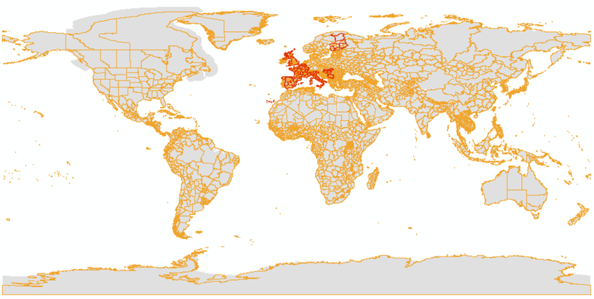
  - **Administrative level 2** as `county` (below)
    Counties in bright blue; regions shown in dark blue. National mapping agency data.
    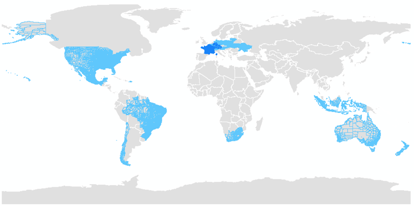
  - **Localities** as `locality` (below)
    In yellow. In the USA this is the smallest unit of government with legal boundaries. For most other countries the localities here are informal parts of local administrative areas. Mix of national mapping agency, quattroshapes enumeration using foursquare checkins & custom data.
    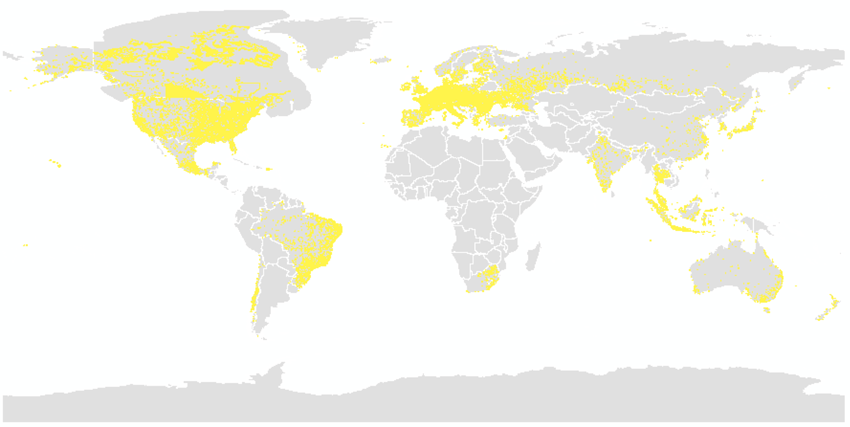
  - **Neighbourhood level** as `neighbourhood` (below)
    In purple.  Informal (vernacular) usage sourced from original Quattroshape enumeration from geo tagged photos in Flickr using GeoPlanet hierarchy.
    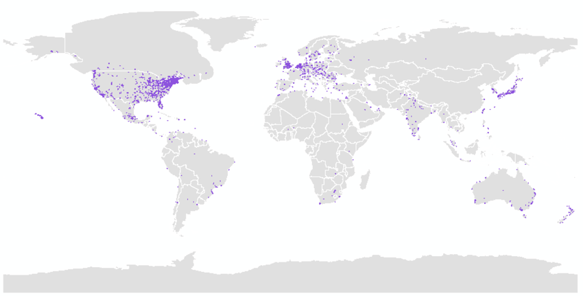
  - **Administrative level 0** as `country` (below)
    In gray. Mix of national mapping agency and US State Department data.
    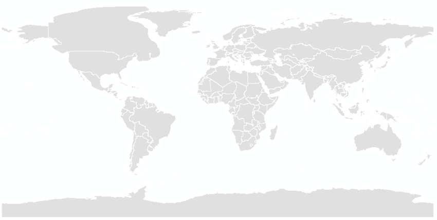
- **Global**: Subsequent import **localadmin** from Quattroshapes as `localadmin` placetype. (Issue [#112](https://github.com/whosonfirst-data/whosonfirst-data/issues/112))
  - Local administrative level as `localadmin` (below)
    In green. This level of government assumes municipal type control over the central town and surrounding countryside. National mapping agency data.
    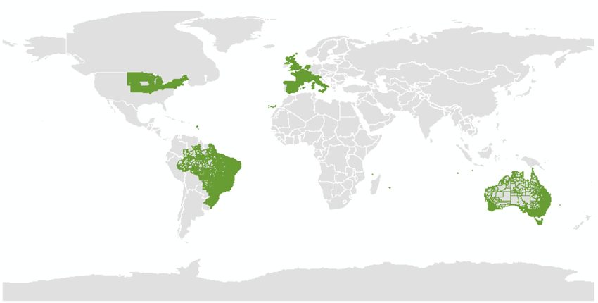
- **United States**: [Zetashapes](https://web.archive.org/web/20160304022454/http://zetashapes.com/) neighbourhood polygons are ingested (some large rural polygons later rolled back), for areas not covered by Quattroshapes. Informal (vernacular) usage sourced from original Zetashapes enumeration from geo tagged photos in Flickr using US Census tract geographies.
    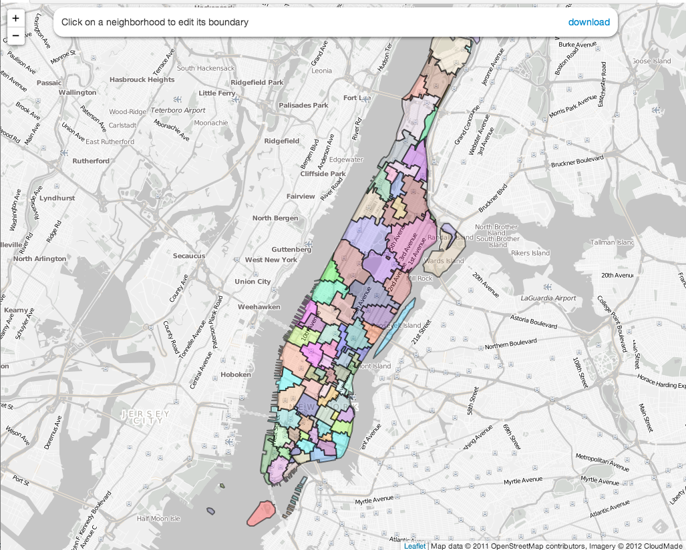

### 2015 January thru December omnibus

- Individual issues and pull requests are not cataloged for 2015 by month

## 2016

### 2016 highlights

- **Global**: Added Wikidata concordances and over 2 million localized names, and population values, for 135,000 records – [blog post](https://www.whosonfirst.org/blog/2016/07/13/wikipedia-data/).
- **Global**: Import population data from Geonames.org. (Issue [#351](https://github.com/whosonfirst-data/whosonfirst-data/issues/351))
- **Global**: Doubled global `county` placetype coverage via [Mesoshapes](https://www.whosonfirst.org/blog/2016/12/08/mesoshapes/), part 1, by adding newer open government data and creating shapes for the missing records.
    
- **Global**: Added timezones and their geometries. (Issue [#553](https://github.com/whosonfirst-data/whosonfirst-data/issues/553))
- **Global**: Import missing admin-1-regions from Quattroshapes as new `macroregion` placetype. (Issue [#34](https://github.com/whosonfirst-data/whosonfirst-data/issues/34), see Quattroshapes region and macroregion map below.)
    
- **Global**: Add new `empire` placetype and link up with existing `country`, `dependency`, and `disputed` records. (Issue [#4](https://github.com/whosonfirst-data/whosonfirst-data/issues/4))
- **Australia**: Improve postcodes from earlier alphashapes from WOF venue properties to official data. (Issue [#472](https://github.com/whosonfirst-data/whosonfirst-data/issues/472))
    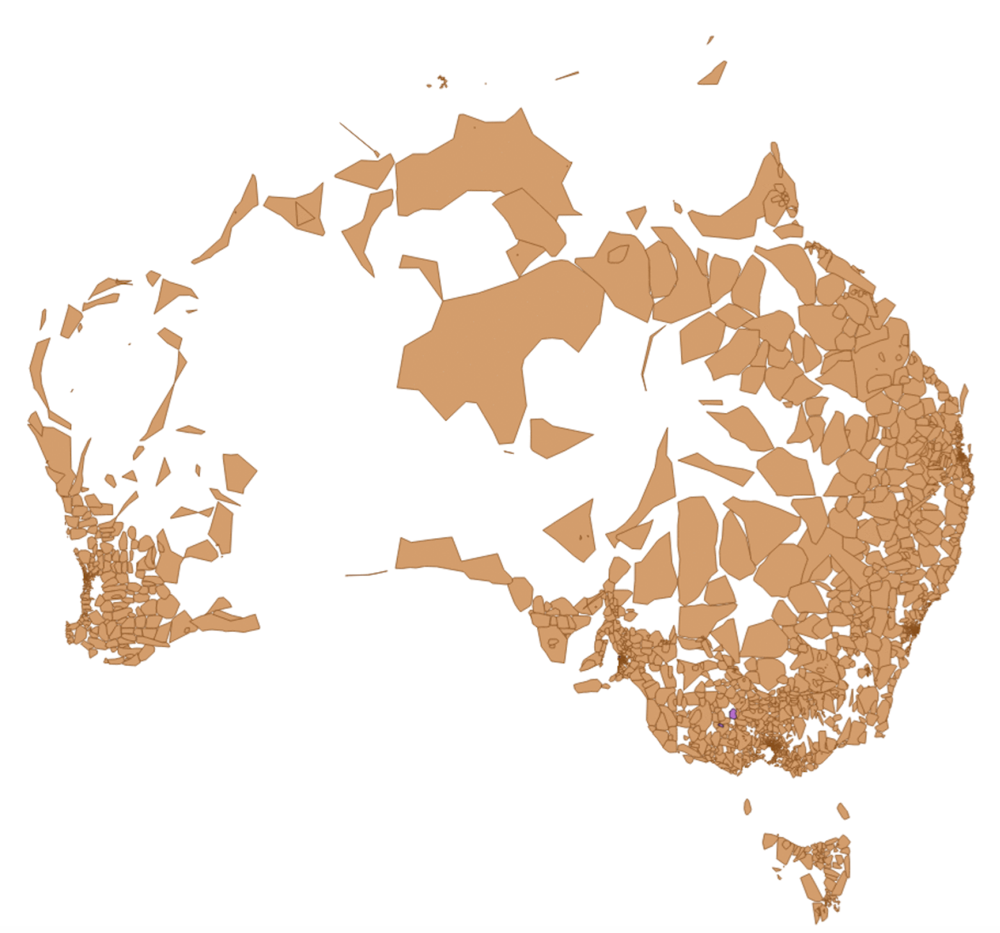
    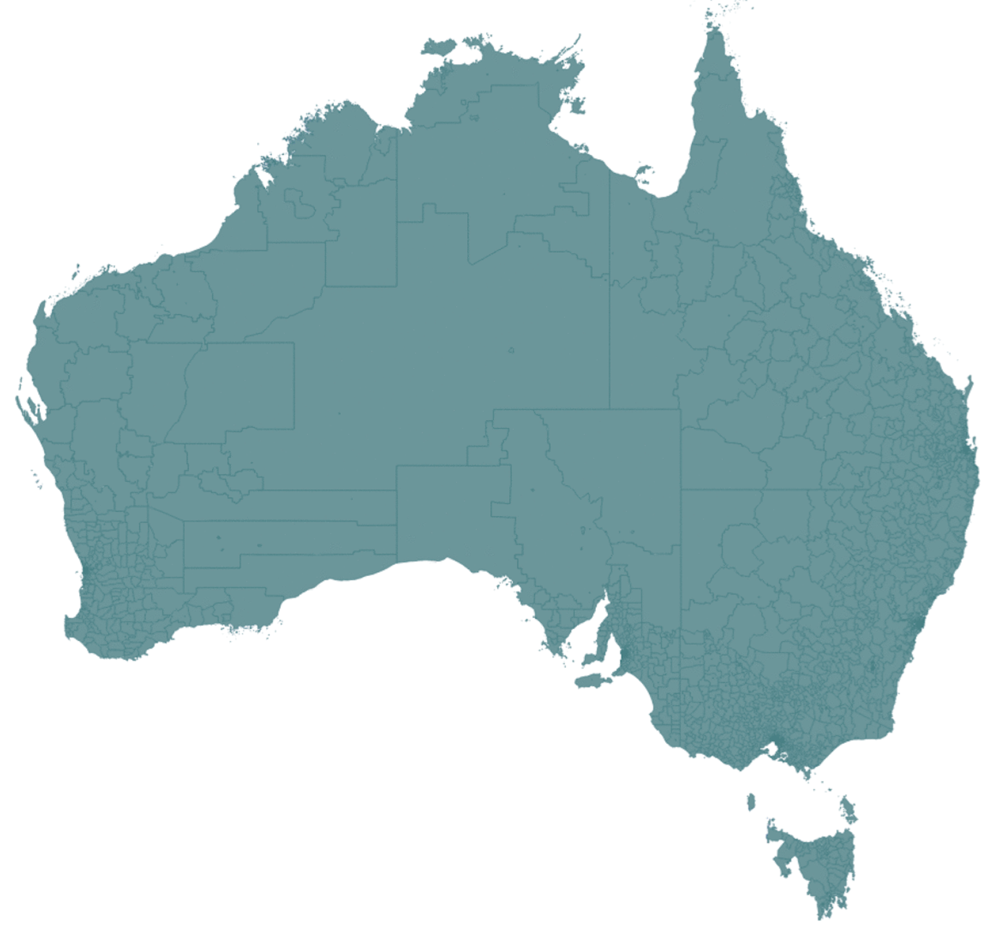
- **Finland**: Added official geometries for localities (Issue [#99](https://github.com/whosonfirst-data/whosonfirst-data/issues/99))
- **France**: Update postalcode records to official govt source. (Issue [#505](https://github.com/whosonfirst-data/whosonfirst-data/issues/505))
- **Japan**: Add sample custom label bounding boxes to Tokyo (Issue [#361](https://github.com/whosonfirst-data/whosonfirst-data/issues/361))
- **United States**: Add sample custom label bounding boxes to SF (Issue [#361](https://github.com/whosonfirst-data/whosonfirst-data/issues/361))
- **United States**: Clip default geometries for `region` features in the US, storing full geometries as reverse geocoding alt geoms. (Issue [#524](https://github.com/whosonfirst-data/whosonfirst-data/issues/524))
    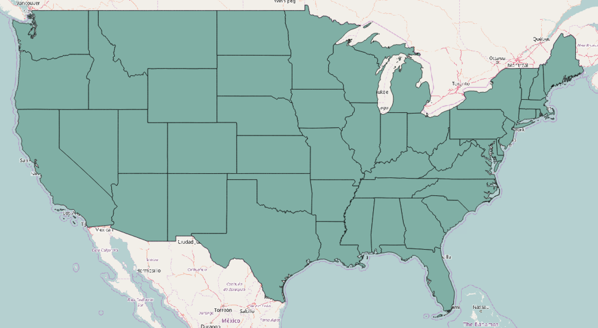
- **Various**: Add new `mz:hierarchy_label` property to indicate if label should be displayed in a list of ancestors. (Issue [#320](https://github.com/whosonfirst-data/whosonfirst-data/issues/320))
- **Various**: Set `mz:hierarchy_label` to false for neighbourhoods in small towns. (Issue [#342](https://github.com/whosonfirst-data/whosonfirst-data/issues/342))
- **Various**: Indicate preferred geometry for reverse geocoding. (Issue [#224](https://github.com/whosonfirst-data/whosonfirst-data/issues/224))
- **Various**: Added a `borough` placetype, with examples in New York city (New York), United States (Issue [#239](https://github.com/whosonfirst-data/whosonfirst-data/issues/239))
- **Various**: Published [guide](https://www.whosonfirst.org/blog/2016/06/24/sf-neighbourhood-updates/) for editing neighbourhoods.
- **Various**: Documented a minimal viable WOF record. (Issue [#195](https://github.com/whosonfirst-data/whosonfirst-data/issues/195))
- **Various**: Fix quattroshapes encoding issues for localities (Issue [#69](https://github.com/whosonfirst-data/whosonfirst-data/issues/69))
- _And many more minor changes..._

### 2016 January thru December omnibus

- Individual issues and pull requests are not cataloged for 2016 by month

## 2017

Jump to month: [January](#2017-January) • [February](#2017-February) • [March](#2017-March) • [April](#2017-April) • [May](#2017-May) • [June](#2017-June) • [July](#2017-July) • [August](#2017-August) • [September](#2017-September) • [October](#2017-October) • [November](#2017-November) • [December](#2017-December)

### 2017 highlights

- **Global**: Added sparse global records from Quattroshapes point gazetter for additional 227,594 `locality` records (large and medium sized global cities), 110,893 `localadmin`, and 67,620 `neighbourhoods`. (Issue [#107](https://github.com/whosonfirst-data/whosonfirst-data/issues/107) and pull request [#824](https://github.com/whosonfirst-data/whosonfirst-data/pull/824))
  - Quattroshapes gazetteer (below) In light purple (imported in 2017). Over 1 million administrative and populated places with around 800,000 having concordance between GeoNames.org and Yahoo! GeoPlanet WOE unique IDs. If polygon feature imported previously then QS point gazetteer's properties are appended to existing WOF records.
    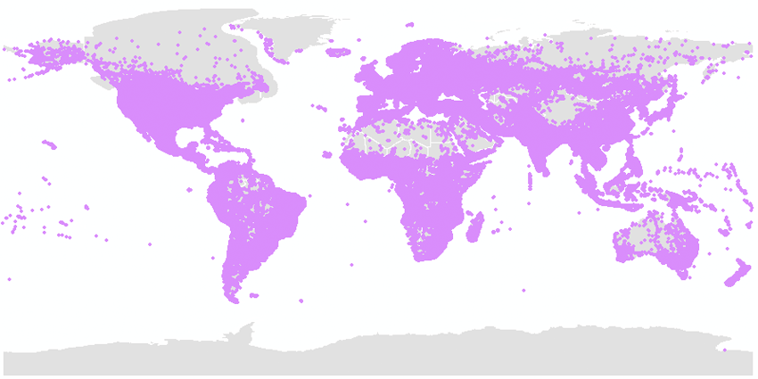
- **Global**: We added missing 1,542 global significant cities from Natural Earth, via pull request [#876](https://github.com/whosonfirst-data/whosonfirst-data/pull/876) – the other features were already in WOF and enriched with Natural Earth properties.
    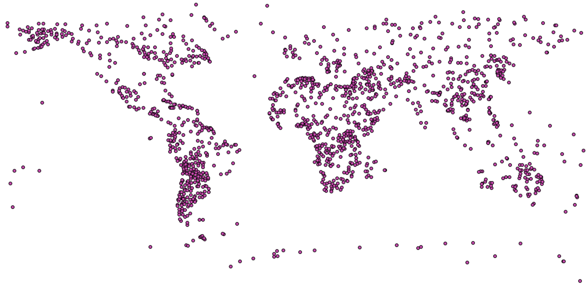
- **Global**: Achieved 99% coverage global for `county` placetype coverage via [Mesoshapes](https://www.whosonfirst.org/blog/2017/09/19/introducing-statoids/), part 2, including rebuilt `region` features for 110 countries and new national mapping agency data in countries like Canada. (Issue [#558](https://github.com/whosonfirst-data/whosonfirst-data/issues/558) and others.)
    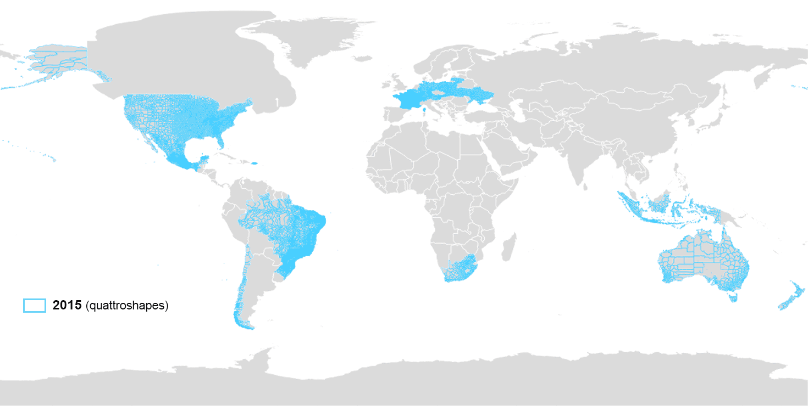
- **Globally**: Neighbourhood shapes improvement projects, [blog post](https://www.whosonfirst.org/blog/2017/04/20/neighbourhood-updates-two/) and [here](https://www.whosonfirst.org/blog/2017/12/14/updating-whosonfirst/) to shrink overly big Zetashapes neighbourhood polygons, and [globally](https://www.whosonfirst.org/blog/2017/12/22/neighbourhood-updates-three/). (Issue [#149](https://github.com/whosonfirst-data/whosonfirst-data/issues/149))
- **Globally**: Added 21M `venue` features from SimpleGeo, [blog post](https://www.whosonfirst.org/blog/2017/10/24/whosonfirst-sotmus-2017/).
- **Global**: Add population from GeoNames using concordance cross-walk. (Issue [#212](https://github.com/whosonfirst-data/whosonfirst-data/issues/212))
- **Global**: Expose `wof:population` property. (Issue [#240](https://github.com/whosonfirst-data/whosonfirst-data/issues/240))
- **Global**: Implode capital locality records. (Issue [#711](https://github.com/whosonfirst-data/whosonfirst-data/issues/711))
- **Global**: Link up countries and their capital cities. (Issue [#57](https://github.com/whosonfirst-data/whosonfirst-data/issues/57))
- **Belgium**: Add postalcode polygons (Issue [#556](https://github.com/whosonfirst-data/whosonfirst-data/issues/556))
- **Europe**: Cleanup neighbourhoods for large and medium sized cities in USA and Europe by updating ~17k label centroids and adding ~9k new neighbourhood records. (Issue [#725](https://github.com/whosonfirst-data/whosonfirst-data/issues/725))
- **France**: Update for 2016 region admin changes (Issue [#208](https://github.com/whosonfirst-data/whosonfirst-data/issues/208))
- **Yugoslavia**: Add historical Yugoslavia records to demonstrate `supersedes` and `superseded_by` relationships with time indicators. (Issue [#45](https://github.com/whosonfirst-data/whosonfirst-data/issues/45))
- **United States**: Cleanup neighbourhoods for large and medium sized cities in USA and Europe by updating ~17k label centroids and adding ~9k new neighbourhood records. (Issue [#725](https://github.com/whosonfirst-data/whosonfirst-data/issues/725))
- **Various**: Indicate which geometry alt should be used for reverse geocoding. (Issue [#367](https://github.com/whosonfirst-data/whosonfirst-data/issues/367))
- **Various**: Lot of growing pains around process, tooling, and finding right balance between manual versus automated flows. The work is real.
- **Country rebuilds**: Austria, Australia, Taiwan (partial)
- **Neighbourhoods: Buenos Aires (Argentina); Canada**: Calgary, Edmonton, Montreal, Ottawa, Quebec City, Regina, Saskatoon, Toronto, Vancouver, Victoria, Winnipeg; Finland (Helsinki and greater Finland); Netherlands (Amsterdam and other large cities); Spain (Barcelona and Madrid); United Kingdom (London); United States (Atlanta, Baltimore, Boston, Chicago, Denver, Los Angeles, Minneapolis-St Paul, New Orleans, Oakland, Philladelphia, Portland, Oregon, San Diego, San Jose, Santa Barbara, Washington DC, Arlington, Alexandria, Seattle, San Francisco, New York),

### 2017 January

- **Finland**: Upgrade neighbourhoods in Helsinki (Issue [#442](https://github.com/whosonfirst-data/whosonfirst-data/issues/442))
- **Finland**: Update `src:geom` fields in Finland records. (Issue [#551](https://github.com/whosonfirst-data/whosonfirst-data/issues/551))
- **France**: Update arrondissement names (Issue [#564](https://github.com/whosonfirst-data/whosonfirst-data/issues/564))
- **Sudan**: Update Abyei Special Administrative Area in Sudan/S Sudan. (Issue [#621](https://github.com/whosonfirst-data/whosonfirst-data/issues/621))
- **South Korea**: Fix duplicate county records (Issue [#578](https://github.com/whosonfirst-data/whosonfirst-data/issues/578))
- **United States**: Upgrade neighbourhood shapes for Oakland (East Bay, California) (Issue [#423](https://github.com/whosonfirst-data/whosonfirst-data/issues/423))
- **Various:** Set default min zooms on neighbourhoods when missing (Issue [#585](https://github.com/whosonfirst-data/whosonfirst-data/issues/585))
- _And many more minor changes..._

### 2017 February

- **United States**: Upgrade neighbourhood shapes for Atlanta. (Issue [#395](https://github.com/whosonfirst-data/whosonfirst-data/issues/395))
- **United States**: Upgrade neighbourhood shapes for Baltimore. (Issue [#400](https://github.com/whosonfirst-data/whosonfirst-data/issues/400))
- **United States**: Upgrade neighbourhood shapes for New Orleans
- **United States**: Upgrade neighbourhood shapes for Denver. (Issue [#398](https://github.com/whosonfirst-data/whosonfirst-data/issues/398))
- **United States**: Upgrade neighbourhood shapes for Portland, Ore.
- **United States**: Upgrade neighbourhood shapes for San Diego. (Issue [#399](https://github.com/whosonfirst-data/whosonfirst-data/issues/399))
- **United States**: Upgrade neighbourhood shapes for San Jose (California) (Issue [#424](https://github.com/whosonfirst-data/whosonfirst-data/issues/424))
- **Various**: Make airport campus records consistent with their neighbourhood records. (Issue [#673](https://github.com/whosonfirst-data/whosonfirst-data/issues/673))
- _And many more minor changes..._

### 2017 March

- **Global**: Backfill existing administrative WOF records with HASC code concordances. (Issue [#380](https://github.com/whosonfirst-data/whosonfirst-data/issues/380))
- **Germany**: Upgrade neighbourhood shapes for Berlin neighbourhood. (Issue [#161](https://github.com/whosonfirst-data/whosonfirst-data/issues/161))
- **United States**: Upgrade neighbourhood shapes for Los Angeles (city). (Issue [#387](https://github.com/whosonfirst-data/whosonfirst-data/issues/387))
- **United States**: Upgrade neighbourhood shapes for Philly. (Issue [#386](https://github.com/whosonfirst-data/whosonfirst-data/issues/386))
- _And many more minor changes..._

### 2017 April

- **Europe**: Cleanup neighbourhoods for large and medium sized cities in USA and Europe by updating ~17k label centroids and adding ~9k new neighbourhood records. (Issue [#725](https://github.com/whosonfirst-data/whosonfirst-data/issues/725))
- **Finland**: Import updated neighbourhood and macrohood features in Helsinki (Issue [#748](https://github.com/whosonfirst-data/whosonfirst-data/issues/748))
- **Finland**: Update neighbourhood records in greater Finland (Issue [#568](https://github.com/whosonfirst-data/whosonfirst-data/issues/568))
- **Mexico**: Fix localities in Mexico that are not actually named Mexico but have Mexico `spa_x_preferred` names. (Issue [#703](https://github.com/whosonfirst-data/whosonfirst-data/issues/703))
- **Netherlands**: Upgrade neighbourhood shapes for Amsterdam (Issue [#625](https://github.com/whosonfirst-data/whosonfirst-data/issues/625))
- **Netherlands**: Upgrade neighbourhood shapes for Rotterdam/The Hague (Issue [#633](https://github.com/whosonfirst-data/whosonfirst-data/issues/633))
- **United States**: Cleanup neighbourhoods for large and medium sized cities in USA and Europe by updating ~17k label centroids and adding ~9k new neighbourhood records. (Issue [#725](https://github.com/whosonfirst-data/whosonfirst-data/issues/725))
- **United States**: Upgrade neighbourhood shapes for Boston (Issue [#389](https://github.com/whosonfirst-data/whosonfirst-data/issues/389))
- **United States**: Upgrade neighbourhood shapes for Chicago (Issue [#385](https://github.com/whosonfirst-data/whosonfirst-data/issues/385))
- **United States**: Upgrade New York City (NYC) neighbourhoods shapes. (Issue [#384](https://github.com/whosonfirst-data/whosonfirst-data/issues/384))
- **United States**: Update San Francisco neighbourhoods (Issue [#316](https://github.com/whosonfirst-data/whosonfirst-data/issues/316))
- **United States**: Upgrade Seattle neighbourhoods based on city clerk shapes (Issue [#381](https://github.com/whosonfirst-data/whosonfirst-data/issues/381))
- **United States**: Upgrade neighbourhood shapes for Washington DC, Arlington, Alexandria (Issue [#388](https://github.com/whosonfirst-data/whosonfirst-data/issues/388))
- **Various**: Create new country alt-geometries by dissolving child mesoshape counties (Issue [#611](https://github.com/whosonfirst-data/whosonfirst-data/issues/611))
- **Various**: Warn on [] in names, prefer (). (Issue [#89](https://github.com/whosonfirst-data/whosonfirst-data/issues/89))
- _And many more minor changes..._

### 2017 May

- **Global**: Indicate if a locality is a megacity. (Issue [#790](https://github.com/whosonfirst-data/whosonfirst-data/issues/790))
- **Canada**: Upgrade neighbourhood shapes for Victoria (BC), Canada. (Issues [#422](https://github.com/whosonfirst-data/whosonfirst-data/issues/422) and [#782](https://github.com/whosonfirst-data/whosonfirst-data/issues/782))
- **United States**: Upgrade neighbourhood shapes for Minneapolis-St Paul. (Issue [#390](https://github.com/whosonfirst-data/whosonfirst-data/issues/390))
- **United States**: Introduce `placetype_alt` concept with Piedmont (California) (Issue [#776](https://github.com/whosonfirst-data/whosonfirst-data/issues/776))
- **United States**: Create venue records from The List. (Issue [#805](https://github.com/whosonfirst-data/whosonfirst-data/issues/805))
- _And many more minor changes..._

### 2017 June

- **Global**: Indicate what the locals call their placetype with new `wof:placetype_local` property. (Issue [#712](https://github.com/whosonfirst-data/whosonfirst-data/issues/712))
- **Global**: Country-level official language and `wof:lang`. (Issue [#768](https://github.com/whosonfirst-data/whosonfirst-data/issues/768))
- **Austria**: Upgrade county records' geometries. (Issue [#699](https://github.com/whosonfirst-data/whosonfirst-data/issues/699))
- **Austria**: Add new localadmin features (Issue [#698](https://github.com/whosonfirst-data/whosonfirst-data/issues/698))
- **Austria**: Refine locality polygons (Issue [#546](https://github.com/whosonfirst-data/whosonfirst-data/issues/546))
- **Belgium**: Update name fields for regions (Issue [#102](https://github.com/whosonfirst-data/whosonfirst-data/issues/102))
- **Canada**: Upgrade neighbourhood shapes for Calgary. (Issue [#409](https://github.com/whosonfirst-data/whosonfirst-data/issues/409))
- **Canada**: Upgrade neighbourhood shapes for Montreal, Canada. (Issue [#418](https://github.com/whosonfirst-data/whosonfirst-data/issues/418))
- **Canada**: Upgrade neighbourhood shapes for Toronto. (Issue [#414](https://github.com/whosonfirst-data/whosonfirst-data/issues/414))
- **Canada**: Upgrade neighbourhood shapes for Winnipeg (Issue [#783](https://github.com/whosonfirst-data/whosonfirst-data/issues/783))
- **France**: Update for 2016 region admin changes (Issue [#208](https://github.com/whosonfirst-data/whosonfirst-data/issues/208))
- **France**: Missing county names (Issue [#152](https://github.com/whosonfirst-data/whosonfirst-data/issues/152))
- **New Zealand**: Implode Wellington. (Issue [#118](https://github.com/whosonfirst-data/whosonfirst-data/issues/118))
- **Switzerland**: Missing county names (Issue [#152](https://github.com/whosonfirst-data/whosonfirst-data/issues/152))
- **Yugoslavia**: Add historical Yugoslavia records to demonstrate `supersedes` and `superseded_by` relationships with time indicators. (Issue [#45](https://github.com/whosonfirst-data/whosonfirst-data/issues/45))
- **Various**: Fix country records missing `name:eng_x_preferred` property. (Issue [#767](https://github.com/whosonfirst-data/whosonfirst-data/issues/767))
- **Various**: Update `wof:name` for ~900 Mesoshapes-sourced features with a null or blank `wof:name`. (Issue [#53](https://github.com/whosonfirst-data/whosonfirst-data/issues/53))
- _And many more minor changes..._

### 2017 July

- **Global**: Round 1 Mesoshapes import: Achieved 99% coverage global for `county` placetype coverage via [Mesoshapes](https://www.whosonfirst.org/blog/2017/09/19/introducing-statoids/), part 2, including rebuilt `region` features for 110 countries and new national mapping agency data in countries like Canada. (Issue [#558](https://github.com/whosonfirst-data/whosonfirst-data/issues/558) and others.)
- **Globally**: Neighbourhood shapes improvement projects, [blog post](https://www.whosonfirst.org/blog/2017/04/20/neighbourhood-updates-two/) and [here](https://www.whosonfirst.org/blog/2017/12/14/updating-whosonfirst/) to shrink overly big Zetashapes neighbourhood polygons, and [globally](https://www.whosonfirst.org/blog/2017/12/22/neighbourhood-updates-three/). (Issue [#149](https://github.com/whosonfirst-data/whosonfirst-data/issues/149))
- **Global**: Added 255,000 name concordances from Geonames.org, [blog post](https://www.whosonfirst.org/blog/2017/08/22/summer-2017-wof/), with more holding hands with Natural Earth. (Issue [#806](https://github.com/whosonfirst-data/whosonfirst-data/issues/806))
- **Azerbaijan**: Untangle admin1 and admin2 duplicate features. (Issue [#628](https://github.com/whosonfirst-data/whosonfirst-data/issues/628))
- **Belgium**: Add postalcode polygons (Issue [#556](https://github.com/whosonfirst-data/whosonfirst-data/issues/556))
- **Canada**: Upgrade neighbourhood shapes for Edmonton (Alberta) (Issue [#785](https://github.com/whosonfirst-data/whosonfirst-data/issues/785))
- **Czechia**: Renamed the Czech Republic to Czechia. (Issue [#862](https://github.com/whosonfirst-data/whosonfirst-data/issues/862))
- **France**: These France "country" features are all "overseas" regions. (Issue [#2](https://github.com/whosonfirst-data/whosonfirst-data/issues/2))
- **India**: add new state of Telangana (Issue [#497](https://github.com/whosonfirst-data/whosonfirst-data/issues/497))
- **Kosovo**: Recast existing county features as localadmin features. (Issue [#639](https://github.com/whosonfirst-data/whosonfirst-data/issues/639))
- **Nepal**: Admin cleanup (Issue [#37](https://github.com/whosonfirst-data/whosonfirst-data/issues/37))
- **Papua New Guinea**: Admin cleanup  (Issue [#38](https://github.com/whosonfirst-data/whosonfirst-data/issues/38))
- **Serbia**: Recast existing county features as localadmin features. (Issue [#639](https://github.com/whosonfirst-data/whosonfirst-data/issues/639))
- **Various**: Create new region polygons out of mesoshape county children (Issue [#486](https://github.com/whosonfirst-data/whosonfirst-data/issues/486))
- **Various**: Set English preferred names for non-English `marinearea` features. (Issue [#843](https://github.com/whosonfirst-data/whosonfirst-data/issues/843))
- **Various**: Update ISO-639-3 language codes for Dutch, French, Chinese, and German. (Issue [#291](https://github.com/whosonfirst-data/whosonfirst-data/issues/291))
- **Various**: Cleanup ALL CAPS admin-2-counties names. (Issue [#70](https://github.com/whosonfirst-data/whosonfirst-data/issues/70))
- **Various**: Update ISO-639-3 code concordances. (Issue [#291](https://github.com/whosonfirst-data/whosonfirst-data/issues/291))
- **Various**: Indicate which geometry alt should be used for reverse geocoding. (Issue [#367](https://github.com/whosonfirst-data/whosonfirst-data/issues/367))
- _And many more minor changes..._

### 2017 August

- **Global**: We added missing 1,542 global significant cities from Natural Earth, via pull request [#876](https://github.com/whosonfirst-data/whosonfirst-data/pull/876) – the other features were already in WOF and enriched with Natural Earth properties.
- **Global**: Add `unlc:subdivision` to `wof:concordances` property. (Issue [#641](https://github.com/whosonfirst-data/whosonfirst-data/issues/641))
- **Bangladesh**: Update HASC codes for admin2 features from earlier 1983 configuration. (Issue [#579](https://github.com/whosonfirst-data/whosonfirst-data/issues/579))
- **Canada**: Upgrade neighbourhood shapes for Ottawa. (Issue [#779](https://github.com/whosonfirst-data/whosonfirst-data/issues/779))
- **Canada**: Upgrade neighbourhood shapes for Regina (Issue [#784](https://github.com/whosonfirst-data/whosonfirst-data/issues/784))
- **Canada**: Upgrade neighbourhood shapes for Saskatoon (Issue [#781](https://github.com/whosonfirst-data/whosonfirst-data/issues/781))
- **Russia**: Add reversegeo properties to region records because of complex geometries. (Issue [#635](https://github.com/whosonfirst-data/whosonfirst-data/issues/635))
- **Various**: Add two smaller capital cities for Saint Peters Port, Guernsey and Plymouth, Montserrat (Issue [#738](https://github.com/whosonfirst-data/whosonfirst-data/issues/738))
- **Various**: Add concordance with Natural Earth admin-0 countries (Issue [#103](https://github.com/whosonfirst-data/whosonfirst-data/issues/103))
- _And many more minor changes..._

### 2017 September

- **Global**: Added Statoids HASC code concordances and properties for countries, dependencies, regions, and counties – thanks to Gwillim Law and his daughter Shirley, [blog post](https://www.whosonfirst.org/blog/2017/09/19/introducing-statoids/). (Issue [#906](https://github.com/whosonfirst-data/whosonfirst-data/issues/906), [#581](https://github.com/whosonfirst-data/whosonfirst-data/issues/581) and other related issues.)
- **Global**: Link up countries and their capital cities. (Issue [#57](https://github.com/whosonfirst-data/whosonfirst-data/issues/57))
- **Global**: A few more `min_zoom`, `max_zoom` adjustments for regions. (Issue [#877](https://github.com/whosonfirst-data/whosonfirst-data/issues/877))
- **Argentina**: Upgrade neighbourhoods in Buenos Aires. (Issue [#180](https://github.com/whosonfirst-data/whosonfirst-data/issues/180))
- **Australia**: Rebuild `region` and other placetype improvementss, via new PMSA open government data, [blog post](https://www.whosonfirst.org/blog/2017/12/14/updating-whosonfirst/). (Issue [#534](https://github.com/whosonfirst-data/whosonfirst-data/issues/534))
- **Finland**: Update correct `wof:lang` for Finnish regions. (Issue [#511](https://github.com/whosonfirst-data/whosonfirst-data/issues/511))
- **France**: Clean up dependency hierarchies for United States and France. (Issue [#750](https://github.com/whosonfirst-data/whosonfirst-data/issues/750))
- **France**: Untangle Bassas da India disputed area. (Issue [#7](https://github.com/whosonfirst-data/whosonfirst-data/issues/7))
- **Kosovo**: Add HASC codes for admin2 features with `XK` ISO codes. (Issue [#580](https://github.com/whosonfirst-data/whosonfirst-data/issues/580))
- **Serbia**: Add macro-regions (Issue [#462](https://github.com/whosonfirst-data/whosonfirst-data/issues/462))
- **Sudan**: Update HASC codes and boundaries for county features to reflect 2005, 2011, and 2013 changes. (Issue [#583](https://github.com/whosonfirst-data/whosonfirst-data/issues/583))
- **Uganda**: Update HASC codes for admin2 features for 2005 and 2010 changes. (Issue [#587](https://github.com/whosonfirst-data/whosonfirst-data/issues/587))
- **United States**: Clean up dependency hierarchies for United States and France. (Issue [#750](https://github.com/whosonfirst-data/whosonfirst-data/issues/750))
- **Venezuela**: Update HASC codes for admin2 features, especially in the following regions: Anzoategui, Dependencias Federales, Miranda, Monagas, Nueva Esparta, Sucre. (Issue [#584](https://github.com/whosonfirst-data/whosonfirst-data/issues/584))
- **Various**: Add geometries to empires. (Issue [#335](https://github.com/whosonfirst-data/whosonfirst-data/issues/335))
- _And many more minor changes..._

### 2017 October

- **Global**: Added sparse global records from Quattroshapes point gazetter for additional 227,594 `locality` records (large and medium sized global cities), 110,893 `localadmin`, and 67,620 `neighbourhoods` – see issue [#107](https://github.com/whosonfirst-data/whosonfirst-data/issues/107) and pull request [#824](https://github.com/whosonfirst-data/whosonfirst-data/pull/824).
- **Globally**: Added 21M `venue` features from SimpleGeo, [blog post](https://www.whosonfirst.org/blog/2017/10/24/whosonfirst-sotmus-2017/).
- **Canada**: Upgrade neighbourhood shapes for Quebec City neighbourhoods (Issue [#780](https://github.com/whosonfirst-data/whosonfirst-data/issues/780))
- **Canada**: Upgrade neighbourhood shapes for Vancouver, BC, Canada. (Issue [#421](https://github.com/whosonfirst-data/whosonfirst-data/issues/421))
- **Northern Cyprus**: Clean up localities in Northern Cyprus that list Kosovo in their hierarchy enhancement. (Issue [#352](https://github.com/whosonfirst-data/whosonfirst-data/issues/352))
- **United States**: Upgrade neighbourhood shapes in Santa Barbara (California) (Issue [#1005](https://github.com/whosonfirst-data/whosonfirst-data/issues/1005))
- **United States**: "Super Bowl City" in San Francisco is an obsolete neighbourhood (Issue [#873](https://github.com/whosonfirst-data/whosonfirst-data/issues/873))
- **Various**: Add concordance with Quattroshapes gazetteer IDs to QS geoms concordances. (Issue [#105](https://github.com/whosonfirst-data/whosonfirst-data/issues/105))
- _And many more minor changes..._

### 2017 November

- **Global**: Add GeoNames concordance values to records missing the concordance (for further name localization imports). (Issue [#879](https://github.com/whosonfirst-data/whosonfirst-data/issues/879))
- **Global**: Added 255,000 name concordances from Geonames.org for 135,000 WOF records, [blog post](https://www.whosonfirst.org/blog/2017/08/22/summer-2017-wof/), with more holding hands with Natural Earth. (Issue [#806](https://github.com/whosonfirst-data/whosonfirst-data/issues/806))
- **Global**: Add population from GeoNames using concordance cross-walk. (Issue [#212](https://github.com/whosonfirst-data/whosonfirst-data/issues/212))
- **Global**: Expose `wof:population` property. (Issue [#240](https://github.com/whosonfirst-data/whosonfirst-data/issues/240))
- **Global**: Add UN m49 concordance values for country records. (Issue [#883](https://github.com/whosonfirst-data/whosonfirst-data/issues/883))
- **Global**: Ensure all Natural Earth populated places are in WOF (Issue [#807](https://github.com/whosonfirst-data/whosonfirst-data/issues/807))
- **Japan**: Fixup Japanese county names (post Mesoshape import) (Issue [#527](https://github.com/whosonfirst-data/whosonfirst-data/issues/527))
- **Madagascar**: Import new HASC codes for admin1 and admin2 features for 2009 admin changes. (Issue [#616](https://github.com/whosonfirst-data/whosonfirst-data/issues/616))
- **Netherlands**: Import population data and concordances for municipalities. (Issue [#931](https://github.com/whosonfirst-data/whosonfirst-data/issues/931))
- **Sweden**: Merge Jämtland multi-polygon region. (Issue [#618](https://github.com/whosonfirst-data/whosonfirst-data/issues/618))
- **Taiwan**: Import county-level and macroregion level records. (Issue [#638](https://github.com/whosonfirst-data/whosonfirst-data/issues/638))
- **United States**: Set lbl bbox of Alaska and Russia to not wrap (Issue [#1018](https://github.com/whosonfirst-data/whosonfirst-data/issues/1018))
- **Various**: Add names and GeoNames.org concordances for marinearea, disputed, and dependency placetypes. (Issue [#886](https://github.com/whosonfirst-data/whosonfirst-data/issues/886))
- **Various**: Use `meso:pop_year` to backfill `src:population:date` enhancement properties (Issue [#1000](https://github.com/whosonfirst-data/whosonfirst-data/issues/1000))
- **Various**: Store `statoids:date` as `src:population:date`, not `edtf:inception` (Issue [#938](https://github.com/whosonfirst-data/whosonfirst-data/issues/938))
- **Various**: Fix silly bugs in Quattroshapes, like Chilean localities and Chinese neigbourhoods having incorrect Swiss country codes and places in Ireland being listed in Iran instead. (Issue [#992](https://github.com/whosonfirst-data/whosonfirst-data/issues/992) and [#77](https://github.com/whosonfirst-data/whosonfirst-data/issues/77) and [#853](https://github.com/whosonfirst-data/whosonfirst-data/issues/853))
- **Various**: Cleanup admin-2-county names so they are human readable. (Issue [#71](https://github.com/whosonfirst-data/whosonfirst-data/issues/71))
- **Various**: Cleanup records without admin hierarchies. (Issue [#922](https://github.com/whosonfirst-data/whosonfirst-data/issues/922))
- _And many more minor changes..._

### 2017 December

- **Global**: Implode capital locality records. (Issue [#711](https://github.com/whosonfirst-data/whosonfirst-data/issues/711))
- **Netherlands**: Upgrade neighbourhood shapes for The Netherlands (excludes prior work on Amsterdam, den Haag, Rotterdam, Utrecht). (Issue [#837](https://github.com/whosonfirst-data/whosonfirst-data/issues/837))
- **New Zealand**: Add missing Tokelau dependency (NZ). (Issue [#348](https://github.com/whosonfirst-data/whosonfirst-data/issues/348))
- **Russia**: Update `wof:name` for regions in Russia and Ukraine. (Issue [#307](https://github.com/whosonfirst-data/whosonfirst-data/issues/307))
- **Spain**: Upgrade neighbourhood shapes for Barcelona. (Issue [#415](https://github.com/whosonfirst-data/whosonfirst-data/issues/415))
- **Spain**: Upgrade neighbourhood shapes for Madrid. (Issue [#413](https://github.com/whosonfirst-data/whosonfirst-data/issues/413))
- **Ukraine**: Update `wof:name` for regions in Russia and Ukraine. (Issue [#307](https://github.com/whosonfirst-data/whosonfirst-data/issues/307))
- **United Kingdom**: Upgrade neighbourhood shapes for London. (Issue [#411](https://github.com/whosonfirst-data/whosonfirst-data/issues/411))
- **United Kingdom**: Is London a locality that entirely contains the much smaller City of Westminster region?. (Issue [#225](https://github.com/whosonfirst-data/whosonfirst-data/issues/225))
- **Various**: Consider updating `wof:concordance` to handle multiple valid concordances per source (Issue [#796](https://github.com/whosonfirst-data/whosonfirst-data/issues/796))
- _And many more minor changes..._

## 2018

Jump to month: [January](#2018-January) • [February](#2018-February) • [March](#2018-March) • [April](#2018-April) • [May](#2018-May) • [June](#2018-June) • [July](#2018-July) • [August](#2018-August) • [September](#2018-September) • [October](#2018-October) • [November](#2018-November) • [December](#2018-December)

### 2018 highlights

- **General**: While Mapzen shuts down in Dec 2017, [WOF continued on](https://www.whosonfirst.org/blog/2018/01/02/chapter-two/) in 2018 thru work at Snapchat and SFO Museum.
- **General**: Gazetteer data updates resumed in May, 2018 once Stephen and Nathaniel settled at Snapchat.
- **General**: A loosely affiliated `venue` scraper project launched, [alltheplaces.xyz](https://alltheplaces.xyz) – also seeded by Mapzen.
- **Global**: Update disputed areas from Natural Earth v4.1, including a new set of controlled WOF properties for `mz:hierarchy_label:{placetype}` to indicate which name strings should appear with hierarchy labels in reverse geocoding. (Issue [#1215](https://github.com/whosonfirst-data/whosonfirst-data/issues/1215))
- **Global**: Concordance work with Wikidata (discussion) (Issue [#1284](https://github.com/whosonfirst-data/whosonfirst-data/issues/1284))
- **Global**: GeoNames point locality import, part 1 (Pull request [#1342](https://github.com/whosonfirst-data/whosonfirst-data/pull/1342))
- **Global**: GeoNames locality import, part 2 (Pull request [#1353](https://github.com/whosonfirst-data/whosonfirst-data/pull/1353))
- **Global**: GeoNames locality import, part 3 (Pull request [#1376](https://github.com/whosonfirst-data/whosonfirst-data/pull/1376))
- **Global**: Completed GeoNames populated places import (Issue [#108](https://github.com/whosonfirst-data/whosonfirst-data/issues/108) via part 4 [#1391](https://github.com/whosonfirst-data/whosonfirst-data/pull/1391))
- **Global**: Move buffered point geoms to alts, replace with points, for any Quattroshapes-sourced record with a `qs:type` of "buffered point". (Issue [#234](https://github.com/whosonfirst-data/whosonfirst-data/issues/234))
- **Global**: Use `mz:tier_locality` to set `mz:hierarchy_label` (Issue [#1258](https://github.com/whosonfirst-data/whosonfirst-data/issues/1258))
- **Global**: Create and populate new `wof:shortcode`, mostly for country, region, and county placetypes (Issue [#924](https://github.com/whosonfirst-data/whosonfirst-data/issues/924))
- **Global**: Link up countries and their capital cities with new `wof:capital` and `wof:capital_of` properties (Issue [#57](https://github.com/whosonfirst-data/whosonfirst-data/issues/57))
- **Global**: Improve country geometries when earlier sourced from Natural Earth either by using U.S. Department of State geometries or by dissolving more detailed child features (Issue [#1318](https://github.com/whosonfirst-data/whosonfirst-data/issues/1318))
- **India**: Update Telangana and descendants, including Hyderabad (Issue [#1330](https://github.com/whosonfirst-data/whosonfirst-data/issues/1330))
- **France**: Promote overseas collectivities of France to dependency (from region of France) – St Martin, Saint Pierre, and Miquelon (Issue [#13](https://github.com/whosonfirst-data/whosonfirst-data/issues/13))
- **New Zealand**: Consider a smaller New Zealand geometry, and manage original with GIT LFS (Issue [#834](https://github.com/whosonfirst-data/whosonfirst-data/issues/834))
- **United States**: Append " Township" to name of 13,943 localadmin records in the United States, of US Census twp type (Ohio Township, Indiana which makes more sense than Ohio, Indiana) (Issue [#1260](https://github.com/whosonfirst-data/whosonfirst-data/issues/1260))
- **United States**: Reset unreasonably large Zetashapes neighbourhoods in USA to original smaller geometries (or point centroids) (Issue [#1006](https://github.com/whosonfirst-data/whosonfirst-data/issues/1006) and [#1259](https://github.com/whosonfirst-data/whosonfirst-data/issues/1259))
- **United States**: Add concordances and shortcodes to us-house records whosonfirst-data/whosonfirst-data-constituency-us/#10
- **United States**: Add marketarea records for the US (Issue [#1328](https://github.com/whosonfirst-data/whosonfirst-data/issues/1328))
- **Various**: Add shortcodes and label abbreviations for regions in six countries `region` records in 6 countries (Australia, Brazil, India, China, South Africa, and Russia) to join abbreviations already present in United States. (Issue [#840](https://github.com/whosonfirst-data/whosonfirst-data/issues/840))
- **Various**: Tackle ground truth simplification / alt geoms for 17 records with large geometries causing > 10MB file size (Issue [#1072](https://github.com/whosonfirst-data/whosonfirst-data/issues/1072))
- **Various**: Update uppercase admin2 county names(Pull request [#1424](https://github.com/whosonfirst-data/whosonfirst-data/pull/1424))
- **Various**: Update No Data and NULL names(Pull request [#1420](https://github.com/whosonfirst-data/whosonfirst-data/pull/1420))
- **Various**: SQLite whosonfirst-data-latest.db has not been updated since 2018-01-25 (Issue [#1226](https://github.com/whosonfirst-data/whosonfirst-data/issues/1226))
- **Country rebuilds**: Australia, Netherlands, Austria, Denmark, Finland, Ireland, Norway, Sweden, Hong Kong, Philippines (partial), Belgium (?), France, United Kingdom, Spain (partial)
- **Neighbourhoods**: Park City (Utah, USA)

### 2018 January

- _Gazetteer data updates still paused because of Mapzen shutdown in 2017 December_

### 2018 February

- _Gazetteer data updates still paused..._

### 2018 March

- _Gazetteer data updates still paused..._

### 2018 April

- _Gazetteer data updates still paused..._

### 2018 May

- **General**: Gazetteer data updates resumed in May, 2018 once Stephen and Nathaniel settled at Snapchat.
- **Australia**: Sanitize 559 localadmin / country names which shouldn't also contain their state abbreviation (Issue [#737](https://github.com/whosonfirst-data/whosonfirst-data/issues/737) and [#904](https://github.com/whosonfirst-data/whosonfirst-data/issues/904))
- **eSwatini**: The country of `Swaziland` was renamed to `eSwatini` (Issue [#1179](https://github.com/whosonfirst-data/whosonfirst-data/issues/1179))
- **France**: Fix hierarchy issues in Paris for reverse geocoding (Issue [#608](https://github.com/whosonfirst-data/whosonfirst-data/issues/608))
- **Netherlands**: Deprecate 1,439 records sourced from Quattroshpaes point gazetteer in the Netherlands that are archaic compared to imported national mapping agency data (Issue [#1061](https://github.com/whosonfirst-data/whosonfirst-data/issues/1061))
- **South Korea**: Fixup Korean county names (post Mesoshapes import) (Issue [#528](https://github.com/whosonfirst-data/whosonfirst-data/issues/528))
- **Various**: 5 places had a `wof:country` that is not a two letter ISO code (it's `-99` instead) but should be `XS` (Issue [#1070](https://github.com/whosonfirst-data/whosonfirst-data/issues/1070))
- **Various**: Backfill `mz:is_current` fields for deprecated records (Issue [#456](https://github.com/whosonfirst-data/whosonfirst-data/issues/456))
- **Various**: JSON schema validation and WOF document property normalisation (thanks @vicchi) (Issue [#1190](https://github.com/whosonfirst-data/whosonfirst-data/issues/1190))

### 2018 June

- **Global**: Update disputed areas from Natural Earth v4.1, including a new set of controlled WOF properties for `mz:hierarchy_label:{placetype}` to indicate which name strings should appear with hierarchy labels in reverse geocoding. (Issue [#1215](https://github.com/whosonfirst-data/whosonfirst-data/issues/1215))
- **Argentina**: Clean up disputed records for ice field between Argentina and Chile (Issue [#1133](https://github.com/whosonfirst-data/whosonfirst-data/issues/1133))
- **Australia**: Correct label centroid for Sydney to be in city center instead of far away at airport. (Issue [#1205](https://github.com/whosonfirst-data/whosonfirst-data/issues/1205))
- **Australia**: Fix name of localadmin for Picton (NSW) to remove NSW indicator (Issue [#110](https://github.com/whosonfirst-data/whosonfirst-data/issues/110))
- **Austria**: Upgrade Austrian county geometries by dissolving locality geometries (Issue [#699](https://github.com/whosonfirst-data/whosonfirst-data/issues/699))
- **Austria**: Upgrade Austrian region geometries by dissolving locality geometries (Issue [#696](https://github.com/whosonfirst-data/whosonfirst-data/issues/696))
- **Chile**: Clean up disputed records for ice field between Argentina and Chile (Issue [#1133](https://github.com/whosonfirst-data/whosonfirst-data/issues/1133))
- **Denmark**: Add 98 localadmin records for municipalities, from GeoDanmark. (Issue [#1102](https://github.com/whosonfirst-data/whosonfirst-data/issues/1102))
- **Denmark**: Updates in Faroe Islands (cc, geometry) (Issue [#383](https://github.com/whosonfirst-data/whosonfirst-data/issues/383))
- **Finland**: Add 70 county records, from Statistics Finland. (Issue [#1105](https://github.com/whosonfirst-data/whosonfirst-data/issues/1105))
- **France**: Set `hierarchy_label` on macroregions false (Issue [#1212](https://github.com/whosonfirst-data/whosonfirst-data/issues/1212))
- **Germany**: Fixed weird characters in German name for Suedliche Weinstrasse (so they instead look like ä, ö, ü) (Issue [#1069](https://github.com/whosonfirst-data/whosonfirst-data/issues/1069))
- **Guam**: Cleanup duplicate locality records (Issue [#690](https://github.com/whosonfirst-data/whosonfirst-data/issues/690))
- **Iraq**: Swap polygon geometries for country polygon so it includes Kurdistan, and update hierarchy of new children records. (Issue [#1207](https://github.com/whosonfirst-data/whosonfirst-data/issues/1207))
- **Ireland**: Admin updates for consolidated regions, per 2014 local gov't reform act, from Ireland Ordnance Survey. Duplicate records superseded into a single record for Cork, Donegal, Galway, Kerry, and Mayo. Some featured merged, like: Limerick/Limerick City, North Tipperary/South Tipperary, and Waterford/Waterford City. (Issue [#115](https://github.com/whosonfirst-data/whosonfirst-data/issues/115))
- **Italy**: Fix Rimini name (Issue [#1224](https://github.com/whosonfirst-data/whosonfirst-data/issues/1224))
- **Moldova**: update regions (Issue [#1163](https://github.com/whosonfirst-data/whosonfirst-data/issues/1163))
- **Netherlands**: Import Statoids data for region and county records (Issue [#929](https://github.com/whosonfirst-data/whosonfirst-data/issues/929))
- **Nigeria**: Fix Lagos shape and reverse geocoding properties for hierarchies (Issue [#960](https://github.com/whosonfirst-data/whosonfirst-data/issues/960))
- **Norway**: Update localadmin records, from GeoNorge. (Issue [#1107](https://github.com/whosonfirst-data/whosonfirst-data/issues/1107))
- **Qatar**: Add names for 6 county features (previously NULL names) (Issue [#1230](https://github.com/whosonfirst-data/whosonfirst-data/issues/1230))
- **Romania**: region updates to merge duplicate Tulcea county records (Issue [#1177](https://github.com/whosonfirst-data/whosonfirst-data/issues/1177))
- **Sweden**: Add 2,523 localadmin records, from Sweden Land Survey. (Issue [#1110](https://github.com/whosonfirst-data/whosonfirst-data/issues/1110))
- **Sweden**: Add 290 municipality records as new county records, from Sweden Land Survey. (Issue [#1123](https://github.com/whosonfirst-data/whosonfirst-data/issues/1123))
- **Tuvalu**: Update outlying Tuvalu Islands (Issue [#272](https://github.com/whosonfirst-data/whosonfirst-data/issues/272))
- **Ukraine**: Deprecated records had descendants in error (Issue [#1040](https://github.com/whosonfirst-data/whosonfirst-data/issues/1040))
- **Ukraine**: Fix county incorrectly parented by Moldova because of convex geometry (Issue [#305](https://github.com/whosonfirst-data/whosonfirst-data/issues/305))
- **United States**: Aleutians West has conflicting admin data (because of ±180 geom wrapping) (Issue [#215](https://github.com/whosonfirst-data/whosonfirst-data/issues/215))
- **United States**: Fix bunk Nepali name translation for Portland (Issue [#1219](https://github.com/whosonfirst-data/whosonfirst-data/issues/1219))
- **United States**: Greenfield Town is the wrong name for Greenfield, MA (Issue [#1077](https://github.com/whosonfirst-data/whosonfirst-data/issues/1077))
- **United States**: Update Rose Atoll and Bajo Nuevo Bank to be parented by empire of United States instead of the country (Issue [#1127](https://github.com/whosonfirst-data/whosonfirst-data/issues/1127))
- **Various**: Review all `misc:*` properties and re-assigned most to `qs:*` instead (Issue [#826](https://github.com/whosonfirst-data/whosonfirst-data/issues/826))
- **Various**: Add shortcodes and label abbreviations for regions in six countries `region` records in 6 countries (Australia, Brazil, India, China, South Africa, and Russia) to join abbreviations already present in United States. (Issue [#840](https://github.com/whosonfirst-data/whosonfirst-data/issues/840))
- **Various**: Correct `wk` prefix on many properties to `wd` for information imported from Wikidata. (Issue [#1201](https://github.com/whosonfirst-data/whosonfirst-data/issues/1201))
- **Various**: Fix 367 neighbourhoods were missing their hierarchies, across Japan, Saudi Arabia, Egyupt, Peru, Lebanon, Oman, South Korea, Sudan, United Arab Emerates, and United States.  (Issue [#1225](https://github.com/whosonfirst-data/whosonfirst-data/issues/1225))
- **Various**: Fix 360 records that were missing a hierarchy (Issue [#922](https://github.com/whosonfirst-data/whosonfirst-data/issues/922))
- **Various**: Sanity check hierarchies for string values (oops) (Issue [#450](https://github.com/whosonfirst-data/whosonfirst-data/issues/450))

### 2018 July

- **Global**: Use `mz:tier_locality` to set `mz:hierarchy_label` (Issue [#1258](https://github.com/whosonfirst-data/whosonfirst-data/issues/1258))
- **Australia**: Clean up hierarchy and controlled properties for Sydney (Issue [#731](https://github.com/whosonfirst-data/whosonfirst-data/issues/731))
- **Hong Kong**: was missing continent in hierarchy (Issue [#1206](https://github.com/whosonfirst-data/whosonfirst-data/issues/1206))
- **Poland**: Update ISO code for descendants (to PL from bad PO from Quattroshapes) (Issue [#1236](https://github.com/whosonfirst-data/whosonfirst-data/issues/1236))
- **Slovenia**: Imported administrative data from the Surveying and Mapping Authority of the Republic of Slovenia. 12 new region records (with `mz:hierarchy_label` property of `0` and `wof:statistical_gore` property of `1`), 212 new `localadmin` records (and region records deprecated) (Issue [#755](https://github.com/whosonfirst-data/whosonfirst-data/issues/755))
- **Spain**: Canary Islands and descendents were missing hierarchy because of centroid in water (Issue [#201](https://github.com/whosonfirst-data/whosonfirst-data/issues/201))
- **Sweden**: Add Swedish municipalities from Sweden Land Survey (Issue [#617](https://github.com/whosonfirst-data/whosonfirst-data/issues/617))
- **United Kingdom**: Fix up Edinburgh and Musselburgh localities (Issue [#1011](https://github.com/whosonfirst-data/whosonfirst-data/issues/1011))
- **United Kingdom**: Neighbourhoods in Solihull should be descendants of the locality of Solihull (Issue [#1221](https://github.com/whosonfirst-data/whosonfirst-data/issues/1221))
- **United States**: Corrects properties, name translations, and concordance values in the Multnomah neighbourhood. (Issue [#1248](https://github.com/whosonfirst-data/whosonfirst-data/issues/1248))
- **United States**: Updates from US Census Table and Geography Changes, including Wade Hampton Census Area, Alaska, was renamed as Kusilvak Census Area, Shannon County, South Dakota, was renamed as Oglala Lakota County, Helena and McRae cities in Georgia have merged, Thomson city in Carlton County, Minnesota was merged into Carlton city, ceased Islandia City (Florida), Helena City (Georgia), McRae City (Georgia),  Millville City (Iowa), Thomson City (Minnesota). (Issue [#766](https://github.com/whosonfirst-data/whosonfirst-data/issues/766))
- **United States**: Updates ISO and WOF country codes for record on the US/MX border. (Issue [#1249](https://github.com/whosonfirst-data/whosonfirst-data/issues/1249))
- **Various**: Diego Garcia NSF isn't a dependency and had bad WOE sourced names (Issue [#9](https://github.com/whosonfirst-data/whosonfirst-data/issues/9))
- **Various**: Fix duplicate dependency/region records in Guam, Puerto Rico & etc (Issue [#988](https://github.com/whosonfirst-data/whosonfirst-data/issues/988))

### 2018 August

- **Global**: Concordance work with Wikidata (discussion) (Issue [#1284](https://github.com/whosonfirst-data/whosonfirst-data/issues/1284))
- **Canada**: Add county and locality records in Alberta (Issue [#1044](https://github.com/whosonfirst-data/whosonfirst-data/issues/1044))
- **Canada**: Clean up county records (from 231 to 291 features), including marking some statistical gore = 1 (Issues [#926](https://github.com/whosonfirst-data/whosonfirst-data/issues/926) and [#666](https://github.com/whosonfirst-data/whosonfirst-data/issues/666))
- **France**: Promote overseas collectivities of France to dependency (from region of France) – St Martin, Saint Pierre, and Miquelon (Issue [#13](https://github.com/whosonfirst-data/whosonfirst-data/issues/13))
- **Hong Kong**: Update country, macroregion, region & more records, from Hong Kong Open Data portal. (Issue [#1106](https://github.com/whosonfirst-data/whosonfirst-data/issues/1106))
- **Mauritius**: Remove outmoded Île de France name variant in French for Mauritius (Issue [#1286](https://github.com/whosonfirst-data/whosonfirst-data/issues/1286))
- **Philippines**: Rework National Capital Region (Issue [#1214](https://github.com/whosonfirst-data/whosonfirst-data/issues/1214))
- **Sri Lanka**: Add English name for Ratnapura (Issue [#1254](https://github.com/whosonfirst-data/whosonfirst-data/issues/1254))
- **United States**: Add dual hierarchy for SFO airport to include San Mateo county, because geography (Issue [#1289](https://github.com/whosonfirst-data/whosonfirst-data/issues/1289))
- **United States**: Add Park City (Utah) neighbourhoods (Issue [#1264](https://github.com/whosonfirst-data/whosonfirst-data/issues/1264))
- **United States**: Append " Township" to name of 13,943 localadmin records in the United States, of US Census twp type (Ohio Township, Indiana which makes more sense than Ohio, Indiana) (Issue [#1260](https://github.com/whosonfirst-data/whosonfirst-data/issues/1260))
- **United States**: Reset unreasonably large Zetashapes neighbourhoods in USA to original smaller geometries (or point centroids) (Issue [#1006](https://github.com/whosonfirst-data/whosonfirst-data/issues/1006) and [#1259](https://github.com/whosonfirst-data/whosonfirst-data/issues/1259))
- **United States**: SFO airport campus geometry changes (Issue [#1287](https://github.com/whosonfirst-data/whosonfirst-data/issues/1287))
- **United States**: Superceed duplicate point record Nashville locality into polygon record (Issue [#1082](https://github.com/whosonfirst-data/whosonfirst-data/issues/1082))
- **Various**: Updates to China, India, Pakistan for country, disputed, and region placetypes (Issue [#169](https://github.com/whosonfirst-data/whosonfirst-data/issues/169)  and pull request [#1280](https://github.com/whosonfirst-data/whosonfirst-data/pull/1280))
- **Various**: Fix 78 records that had self-intersecting geometries (Issue [#1071](https://github.com/whosonfirst-data/whosonfirst-data/issues/1071))

### 2018 September

- **Global**: Create and populate new `wof:shortcode`, mostly for country, region, and county placetypes (Issue [#924](https://github.com/whosonfirst-data/whosonfirst-data/issues/924))
- **Global**: Link up countries and their capital cities with new `wof:capital` and `wof:capital_of` properties (Issue [#57](https://github.com/whosonfirst-data/whosonfirst-data/issues/57))
- **Australia**: Broadbench, a neighborhood in Queensland, needed a reverse geocoding centroid (Issue [#1075](https://github.com/whosonfirst-data/whosonfirst-data/issues/1075))
- **Australia**: Cleanup reverse geocoding geometries to resolve 2 capital city regressions related to few island places in France and Australia empires (Issue [#1027](https://github.com/whosonfirst-data/whosonfirst-data/issues/1027))
- **Austria**: Ensure current and `src:geom` property on recently imported records (Issue [#1285](https://github.com/whosonfirst-data/whosonfirst-data/issues/1285))
- **Austria**: Fix some Austrian cities that were listed in Australia (oops), from Quattroshapes. (Issue [#1255](https://github.com/whosonfirst-data/whosonfirst-data/issues/1255))
- **Canada**: Fix Burnaby (British Columbia) descendants by correcting reverse geocoding centroid (Issue [#1276](https://github.com/whosonfirst-data/whosonfirst-data/issues/1276))
- **Canada**: Fix NULL name for record 890458063 (Issue [#1308](https://github.com/whosonfirst-data/whosonfirst-data/issues/1308))
- **France**: Cleanup reverse geocoding geometries to resolve 2 capital city regressions related to few island places in France and Australia empires (Issue [#1027](https://github.com/whosonfirst-data/whosonfirst-data/issues/1027))
- **Germany**: Untangle Frankfurt am Main vs. Frankfurt (Oder) (Issue [#1294](https://github.com/whosonfirst-data/whosonfirst-data/issues/1294))
- **Italy**: Add reversegeo:* properties to 85685675 on San Marino and Italy frontier (Issue [#1112](https://github.com/whosonfirst-data/whosonfirst-data/issues/1112))
- **Mexico**: Some 534 records were incorrectly given `iso:country` and `wof:country` codes of "ME" (Montenegro) instead of "MX" (Mexico), from Quattroshapes. (Issue [#1315](https://github.com/whosonfirst-data/whosonfirst-data/issues/1315))
- **New Zealand**: Consider a smaller New Zealand geometry, and manage original with GIT LFS (Issue [#834](https://github.com/whosonfirst-data/whosonfirst-data/issues/834))
- **Spain**: Add reverse geoding centroid to Rimini since it's straddling the frontier incorrectly (Issue [#1097](https://github.com/whosonfirst-data/whosonfirst-data/issues/1097))
- **Spain**: Updated single localadmin and descendants (Pull request [#1302](https://github.com/whosonfirst-data/whosonfirst-data/pull/1302))
- **Switzerland**: Update funky lake county to mark it as statistical gore and fix reverse geocoding centroid (Issue [#1104](https://github.com/whosonfirst-data/whosonfirst-data/issues/1104))
- **United States**: Add concordances and shortcodes to us-house records whosonfirst-data/whosonfirst-data-constituency-us/#10
- **United States**: Add marketarea records for the US (Issue [#1328](https://github.com/whosonfirst-data/whosonfirst-data/issues/1328))
- **United States**: Some 3 neighbourhood records in USA had Mexico in their hierarchy incorrectly (Issue [#1313](https://github.com/whosonfirst-data/whosonfirst-data/issues/1313))
- **United States**: Two valid neighbourhood records were incorrectly deprecated in Alexandria neighbourhood (Issue [#803](https://github.com/whosonfirst-data/whosonfirst-data/issues/803))
- **Various**: Fix few records with more than one preferred name (Issue [#1311](https://github.com/whosonfirst-data/whosonfirst-data/issues/1311))
- **Various**: The 'Minor Islands of ~ 20 records were merged/superseded into the relevant region records, including in Germany and Denmark (Issue [#888](https://github.com/whosonfirst-data/whosonfirst-data/issues/888))
- **Various**: Tackle ground truth simplification / alt geoms for 17 records with large geometries causing > 10MB file size (Issue [#1072](https://github.com/whosonfirst-data/whosonfirst-data/issues/1072))
- **Various**: SQLite whosonfirst-data-latest.db has not been updated since 2018-01-25 (Issue [#1226](https://github.com/whosonfirst-data/whosonfirst-data/issues/1226))

### 2018 October

- **Global**: GeoNames point locality import, part 1 (Issue [#1342](https://github.com/whosonfirst-data/whosonfirst-data/issues/1342))
- **Global**: Improve country geometries when earlier sourced from Natural Earth either by using U.S. Department of State geometries or by dissolving more detailed child features (Issue [#1318](https://github.com/whosonfirst-data/whosonfirst-data/issues/1318))
- **Cuba**: Untangle San Luis, Cuba region and county (Issue [#911](https://github.com/whosonfirst-data/whosonfirst-data/issues/911))
- **France**: Revert Paris neighbourhoods because of licensing issues (later re-added from different source) (Issue [#1204](https://github.com/whosonfirst-data/whosonfirst-data/issues/1204))
- **Greece**: region updates to add North Aegean, autonomous region of Mt. Athos, and cut up existing geometries of East Macedonia and Thrace to assign various islands to the correct region. (Issue [#1145](https://github.com/whosonfirst-data/whosonfirst-data/issues/1145))
- **India**: Update Telangana and descendants, including Hyderabad (Issue [#1330](https://github.com/whosonfirst-data/whosonfirst-data/issues/1330))
- **New Zealand**: Add localized names to the New Zealand record (still figuring out GIT LFS) (Issue [#969](https://github.com/whosonfirst-data/whosonfirst-data/issues/969))
- **United States**: NYC neighbourhood clean-up for Clinton (Hell's Kitchen), Uptown, and Lincoln Square. (Issue [#1229](https://github.com/whosonfirst-data/whosonfirst-data/issues/1229))
- **Various**: airports data imports and cleanups (Pull requests [#1361](https://github.com/whosonfirst-data/whosonfirst-data/pull/1361), [#1356](https://github.com/whosonfirst-data/whosonfirst-data/pull/1356), [#1350](https://github.com/whosonfirst-data/whosonfirst-data/pull/1350), [#1348](https://github.com/whosonfirst-data/whosonfirst-data/pull/1348), [#1354](https://github.com/whosonfirst-data/whosonfirst-data/pull/1354), [#1344](https://github.com/whosonfirst-data/whosonfirst-data/pull/1344), and [#1345](https://github.com/whosonfirst-data/whosonfirst-data/pull/1345))

### 2018 November

- **Global**: GeoNames locality import, part 2(Pull request [#1353](https://github.com/whosonfirst-data/whosonfirst-data/pull/1353))
- **Global**: GeoNames locality import, part 3(Pull request [#1376](https://github.com/whosonfirst-data/whosonfirst-data/pull/1376))
- **Australia**: Australian Capital Territory abbreviation is not CT (Issue [#1349](https://github.com/whosonfirst-data/whosonfirst-data/issues/1349))
- **Australia**: Updated codes for Victoria ready (Pull request [#1395](https://github.com/whosonfirst-data/whosonfirst-data/pull/1395))
- **Belgium**: Verify macroregions with `hierarchy_label=1` and reset to 0 for Italy, Spain, and Belgium (Issue [#1370](https://github.com/whosonfirst-data/whosonfirst-data/issues/1370))
- **Canada**: Clean-up various preferred names of localities (Issue [#1409](https://github.com/whosonfirst-data/whosonfirst-data/issues/1409))
- **China**: Update region names and ISO codes (Issue [#1402](https://github.com/whosonfirst-data/whosonfirst-data/issues/1402))
- **Egypt**: Clean-up parent records of Cairo for three governates (Issue [#1366](https://github.com/whosonfirst-data/whosonfirst-data/issues/1366))
- **France**: Significant reworking of localadmin and locality records in France, including marking many that are unitary with `wof:placetype_alt`, and retiring of many of the earlier Quattroshapes polygons, from IGN. (Issue [#1094](https://github.com/whosonfirst-data/whosonfirst-data/issues/1094) and [#1277](https://github.com/whosonfirst-data/whosonfirst-data/issues/1277))
- **France**: Update `fra_x_preferred` name for Saint-Alban locality (Issue [#1351](https://github.com/whosonfirst-data/whosonfirst-data/issues/1351))
- **India**: Region cleanup, properties and geometries(Pull request [#1341](https://github.com/whosonfirst-data/whosonfirst-data/pull/1341))
- **Italy**: Verify macroregions with `hierarchy_label=1` and reset to 0 for Italy, Spain, and Belgium (Issue [#1370](https://github.com/whosonfirst-data/whosonfirst-data/issues/1370))
- **Pakistan**: Update regions (like for defunct Federally Administered Tribal Areas) and add Urdu names (Issue [#1404](https://github.com/whosonfirst-data/whosonfirst-data/issues/1404))
- **Philippines**: Correct Manilla locality name from earlier work in (Issue [#1214 around the national capital region #1378](https://github.com/whosonfirst-data/whosonfirst-data/issues/1214 around the national capital region #1378))
- **Philippines**: locality of Hinoba-an has an out of date name (which Asia) (Issue [#1365](https://github.com/whosonfirst-data/whosonfirst-data/issues/1365))
- **Russia**: Update region names for English and Cyrilic, and add more name localizations and `placetype_local` indications (Issue [#1397](https://github.com/whosonfirst-data/whosonfirst-data/issues/1397))
- **Saudi Arabia**: Admin redux for region and county names and translations, including for English and Arabic (Issue [#1413](https://github.com/whosonfirst-data/whosonfirst-data/issues/1413))
- **Spain**: Verify macroregions with `hierarchy_label=1` and reset to 0 for Italy, Spain, and Belgium (Issue [#1370](https://github.com/whosonfirst-data/whosonfirst-data/issues/1370))
- **Switzerland**: Fix Bern and the Bundesstadt (Issue [#1363](https://github.com/whosonfirst-data/whosonfirst-data/issues/1363))
- **Ukraine**: Add consistency to `wof:name` values (Issue [#1371](https://github.com/whosonfirst-data/whosonfirst-data/issues/1371))
- **Ukraine**: Update regions (Pull request [#1384](https://github.com/whosonfirst-data/whosonfirst-data/pull/1384))
- **United Kingdom**: major placetype cleanup to add new ceremonial county records at the region placetype, move pre-existing WOF region records to the county placetype, set the localadmin and region records in Scotland as coterminous, add new region records to Northern Ireland, Add county to `placetype_alt` of London or make new `coterminous` record with label hierarchy 0, pdate buffered point geometries to points, with appropriate property flags, flag null localadmin as statistical gore, no hier label, update name, and more.(Pull request [#1368](https://github.com/whosonfirst-data/whosonfirst-data/pull/1368) and issues [#1265](https://github.com/whosonfirst-data/whosonfirst-data/issues/1265), [#1228](https://github.com/whosonfirst-data/whosonfirst-data/issues/1228), [#44](https://github.com/whosonfirst-data/whosonfirst-data/issues/44), and [#1367](https://github.com/whosonfirst-data/whosonfirst-data/issues/1367))
- **United Kingdom**: Superceed two more funky London records into the capital city record (Issue [#1360](https://github.com/whosonfirst-data/whosonfirst-data/issues/1360))
- **Various**: Incorrect hierarchy for Abu Musa Island between United Arab Emirates and Iran (Issue [#1382](https://github.com/whosonfirst-data/whosonfirst-data/issues/1382))
- **Various**: More airport campus fixes, thanks @imresamu (Pull request [#1392](https://github.com/whosonfirst-data/whosonfirst-data/pull/1392), [#1390](https://github.com/whosonfirst-data/whosonfirst-data/pull/1390), [#1389](https://github.com/whosonfirst-data/whosonfirst-data/pull/1389), [#1388](https://github.com/whosonfirst-data/whosonfirst-data/pull/1388), [#1387](https://github.com/whosonfirst-data/whosonfirst-data/pull/1387), [#1386](https://github.com/whosonfirst-data/whosonfirst-data/pull/1386), and [#1375](https://github.com/whosonfirst-data/whosonfirst-data/pull/1375))

### 2018 December

- **Global**: Completed GeoNames populated places import (Issue [#108](https://github.com/whosonfirst-data/whosonfirst-data/issues/108) via part 4 pull request [#1391](https://github.com/whosonfirst-data/whosonfirst-data/pull/1391))
- **Global**: Move buffered point geoms to alts, replace with points, for any Quattroshapes-sourced record with a `qs:type` of "buffered point". (Issue [#234](https://github.com/whosonfirst-data/whosonfirst-data/issues/234))
- **Canada**: Post-merge neighbourhood cleanup in Calgary neighbourhood (Issue [#838](https://github.com/whosonfirst-data/whosonfirst-data/issues/838))
- **Finland**: Add macroregion and region data (Issue [#1099](https://github.com/whosonfirst-data/whosonfirst-data/issues/1099))
- **Finland**: Cleanup outdated and new localadmin records (Issue [#1184](https://github.com/whosonfirst-data/whosonfirst-data/issues/1184))
- **France**: Update Marseille (Issue [#1439](https://github.com/whosonfirst-data/whosonfirst-data/issues/1439))
- **France**: Update names in Lyon and parents (Issue [#1427](https://github.com/whosonfirst-data/whosonfirst-data/issues/1427))
- **Italy**: Add new region of South Sardinia (from 4 February 2016) (Issue [#798](https://github.com/whosonfirst-data/whosonfirst-data/issues/798))
- **Italy**: Update country geometry to exclude San Marino and Vatican City, and include Campione D'Italia.  (Issue [#1414](https://github.com/whosonfirst-data/whosonfirst-data/issues/1414))
- **Spain**: Update names, translations for regions, and updated macroregion and region geometries (Issue [#42](https://github.com/whosonfirst-data/whosonfirst-data/issues/42))
- **United Arab Emirates**: Update names for regions (Issue [#1422](https://github.com/whosonfirst-data/whosonfirst-data/issues/1422))
- **Various**: Fix "No data" name (Issue [#1411](https://github.com/whosonfirst-data/whosonfirst-data/issues/1411))
- **Various**: Fix more airport campuses (Pull requests [#1437](https://github.com/whosonfirst-data/whosonfirst-data/pull/1437), [#1419](https://github.com/whosonfirst-data/whosonfirst-data/pull/1419), [#1418](https://github.com/whosonfirst-data/whosonfirst-data/pull/1418), [#1417](https://github.com/whosonfirst-data/whosonfirst-data/pull/1417), [#1416](https://github.com/whosonfirst-data/whosonfirst-data/pull/1416))
- **Various**: Update uppercase admin2 county names(Pull request [#1424](https://github.com/whosonfirst-data/whosonfirst-data/pull/1424))
- **Various**: Update No Data and NULL names(Pull request [#1420](https://github.com/whosonfirst-data/whosonfirst-data/pull/1420))

## 2019

Jump to month: [January](#2019-January) • [February](#2019-February) • [March](#2019-March) • [April](#2019-April) • [May](#2019-May) • [June](#2019-June) • [July](#2019-July) • [August](#2019-August) • [September](#2019-September) • [October](#2019-October) • [November](#2019-November) • [December](#2019-December)

### 2019 highlights

- **Global**: Achieve 99% global `locality` coverage via Geonames.org ingest of missing records, [blog post](https://www.whosonfirst.org/blog/2019/05/13/geonames/). This increased locality count from 345,000 to just over 4.4 million records (+12.7x increase), with a new total number of administrative records in the whosonfirst-data repositories to 4.8 million places.
  - Before / after Geonames import maps:
    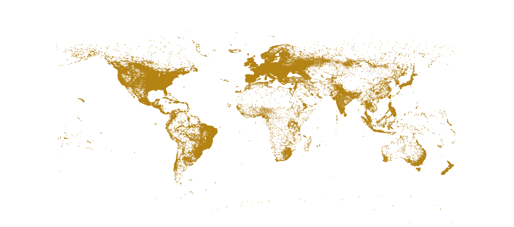
    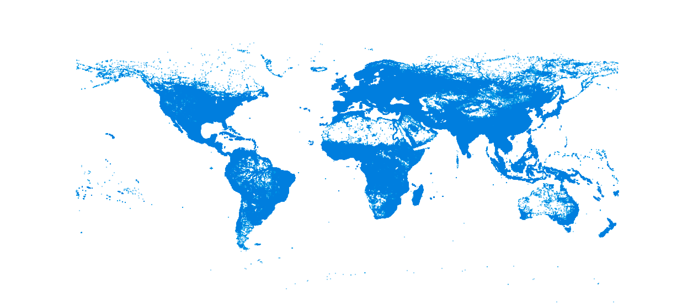
- **Global**: Rerun Wikidata name localization import on per-country repos. This yielded 11,765,604 new names added across 972,158 records. (Issue [#1656](https://github.com/whosonfirst-data/whosonfirst-data/issues/1656))
- **Global**: The big data mono-repo is split into per-country repos at Github's request because "so much datas", [blog post](https://www.whosonfirst.org/blog/2019/05/09/changes/).
- **France**: Corrected postalcode hierarchies (Issue [#1713](https://github.com/whosonfirst-data/whosonfirst-data/issues/1713))
- **India: Add detailed admin subdivisions for largest localities in India, including**: Ahmedabad, Bangalore, Chandigarh, Chennai, Delhi, Hyderabad, Jaipur, Kolkata, Mumbai, and Pune. (Issue [#1593](https://github.com/whosonfirst-data/whosonfirst-data/issues/1593))
- **India**: Add additional 242,827 name localizations to 18,679 admin places (Issue [#1763](https://github.com/whosonfirst-data/whosonfirst-data/issues/1763))
- **India**: Add polygons for "100" largest cities in India (Issue [#1592](https://github.com/whosonfirst-data/whosonfirst-data/issues/1592))
- **India**: Updated administrative records in select localities in India (Issue [#1593](https://github.com/whosonfirst-data/whosonfirst-data/issues/1593))
- **India**: Upgrade neighbourhood records in Hyderabad, India (Issue [#661](https://github.com/whosonfirst-data/whosonfirst-data/issues/661))
- **United States**: Remove localadmin from label hierarchy is select states, including: Illinois, Indiana, Kansas, Missouri, Nebraska, North Dakota, Ohio, and South Dakota. (Issue [#1586](https://github.com/whosonfirst-data/whosonfirst-data/issues/1586))
- **United States**: Some new GeoNames locality records for mobile home parks should be campuses instead (Issue [#1431](https://github.com/whosonfirst-data/whosonfirst-data/issues/1431))
- **United States**: Update region labels (Issue [#1590](https://github.com/whosonfirst-data/whosonfirst-data/issues/1590))
- **United States**: Updates the region, locality, and county records in Washington, DC, tagging records as coterminous and updating hierarchy label properties (Issue [#1576](https://github.com/whosonfirst-data/whosonfirst-data/issues/1576))
- **Various**: Cleanup and add Arabic name translation in Arabic speaking countries (Pull request [#1465](https://github.com/whosonfirst-data/whosonfirst-data/pull/1465))
- **Various**: Update capital city geometries to harvest polygons from unitary parent features, followup to Issue [#57](https://github.com/whosonfirst-data/whosonfirst-data/issues/57). (Issue [#1496](https://github.com/whosonfirst-data/whosonfirst-data/issues/1496))
- **Various**: Adjust and add `label:*` properties to 41k macroregion, region, macrocounty, county, and localadmin placetypes for name, placetype, longname & etc in mutliple languages (Issue [#1534](https://github.com/whosonfirst-data/whosonfirst-data/issues/1534))
- **Various**: Fix inconsistent french iso code ISO 3166 (`fra_x_preferred` vs `fre_x_preferred`) (Issue [#1282](https://github.com/whosonfirst-data/whosonfirst-data/issues/1282))
- **Various**: Update label shortcodes for country and region with new `label:{lang}_x_preferred_shortcode` property (Issue [#1689](https://github.com/whosonfirst-data/whosonfirst-data/issues/1689))
- **Various**: Many "crawls" for sporatic problems affecting records across repos, like for consecutive spaces in `wof:name` and fix (Issue [#1616](https://github.com/whosonfirst-data/whosonfirst-data/issues/1616))
- **Various**: Addition of `src:alt_label` property to each alt file (Issue [#1714](https://github.com/whosonfirst-data/whosonfirst-data/issues/1714))
- **Various**: For localization, add missing `wof:{lang}_x_*` property to macroregion, region, or macrocounty records (Issue [#1718](https://github.com/whosonfirst-data/whosonfirst-data/issues/1718))
- **Country rebuilds complete**: Saudi Arabia, United Kingdom (follow up), Australia, Israel (partial), Palestine (partial), United Arab Emirates, Hong Kong, Bahrain, Qatar, Germany, Denmark, Switzerland, Poland, Norway
- **Neighbourhoods**: none

### 2019 January

- **Saudi Arabia**: Updated country, region, county, locality, and neighbourhood geometries, often with polygons (Issue [#1468](https://github.com/whosonfirst-data/whosonfirst-data/issues/1468))
- **Saudi Arabia**: Update/verify Arabic translations (Issue [#1462](https://github.com/whosonfirst-data/whosonfirst-data/issues/1462))
- **United Kingdom**: locality vis-a-vis localadmin & general placetype cleanup after November 2018 work (Issue [#1367](https://github.com/whosonfirst-data/whosonfirst-data/issues/1367) and [#1086](https://github.com/whosonfirst-data/whosonfirst-data/issues/1367))
- **United Kingdom**: Exportify and correct two junk records (Pull request [#1467](https://github.com/whosonfirst-data/whosonfirst-data/pull/1467))
- **United States**: Make Coonville in Ohio search only (not for map display) (Pull request [#1444](https://github.com/whosonfirst-data/whosonfirst-data/pull/1444))
- **Various**: Cleanup and add Arabic name translation in Arabic speaking countries (Pull request [#1465](https://github.com/whosonfirst-data/whosonfirst-data/pull/1465))
- **Various**: Fix more airport campus records (Pull request [#1470](https://github.com/whosonfirst-data/whosonfirst-data/pull/1470))
- _Various other edits made directly to the individual country repos as PRs..._

### 2019 February

- **Australia**: add new macrocounty places for "significant urban areas", flag county records with `mz:hierarchy_label` of 0 so they don't show up in labeled reverse geocoding hierarchies, flag any locality and localadmin that are coterminous, deprecated any locality point (GeoNames or Quattroshapes) if it falls within an existing locality polygon, Updates neighbourhoods, deprecating records that share names with their parent locality or – if names are unique – moving the neighbourhood to a point geometry. From Australian Government Open Data Portal (PMSA). (Issue [#218](https://github.com/whosonfirst-data/whosonfirst-data/issues/218))
- **France**: the Spanish exclave of Llívia needed to be removed from the France country geometry (Issue [#1433](https://github.com/whosonfirst-data/whosonfirst-data/issues/1433))
- **France**: Untangle Annecy and Pringy names (cleanup from 2018 work in France) (Issue [#1491](https://github.com/whosonfirst-data/whosonfirst-data/issues/1491))
- **Israel & Palestine**: Improve coverage and polygon detail of disputed records (including adding controlled hierarchies); more consistently align country, region, and county polygons; add polygons for largest cities in Israel; cleanup of localities and neighbourhoods in and around Jerusalem. (Issue [#1473](https://github.com/whosonfirst-data/whosonfirst-data/issues/1473))
- **South Africa**: rename "Northern Province" region "Limpopo" (since 2003!) (Issue [#1458](https://github.com/whosonfirst-data/whosonfirst-data/issues/1458))
- **United Arab Emirates**: add locality polygons, rework neighbourhoods (Issue [#1472](https://github.com/whosonfirst-data/whosonfirst-data/issues/1472))
- **United Arab Emirates**: updated country (and for Oman), region, and county records (Issue [#1421](https://github.com/whosonfirst-data/whosonfirst-data/issues/1421))
- **United Kingdom**: Deprecate Drumhirk locality (Issue [#1481](https://github.com/whosonfirst-data/whosonfirst-data/issues/1481))
- **United States**: Some new GeoNames locality records for mobile home parks should be campuses instead (Issue [#1431](https://github.com/whosonfirst-data/whosonfirst-data/issues/1431))
- _Various other edits made directly to the individual country repos as PRs..._

### 2019 March

- **Aruba and Curacao**: updates to mark regions `wof:coterminous` with the country, flag `mz:hierarchy_label` = 0, and updates names (Issue [#1500](https://github.com/whosonfirst-data/whosonfirst-data/issues/1500))
- **Australia**: Clean up neighbourhood records by setting `mz:hierarchy_label` = 0 flag and Polygon or MultiPolygon geometries to alts (keeping default geoms a point). (Issue [#1521](https://github.com/whosonfirst-data/whosonfirst-data/issues/1521))
- **Bahrain**: Update regions and country geometries (Issue [#1512](https://github.com/whosonfirst-data/whosonfirst-data/issues/1512))
- **Canada**: Fix Northern Vancouver District names (Issue [#1556](https://github.com/whosonfirst-data/whosonfirst-data/issues/1556))
- **France**: Resolve duplicate records for Lyon (Issue [#1560](https://github.com/whosonfirst-data/whosonfirst-data/issues/1560))
- **Hong Kong**: Locality of Hong Kong didn't have a polygon, so it was never returned by getHierarchiesByLatLon (Issue [#993](https://github.com/whosonfirst-data/whosonfirst-data/issues/993))
- **Lebanon**: Update region records for new administrative divisions. Beirut and Tripoli locality and neighbourhood updates. (Issue [#629](https://github.com/whosonfirst-data/whosonfirst-data/issues/629))
- **New Zealand**: Update country record with `lbl:bbox` and population (Issue [#1561](https://github.com/whosonfirst-data/whosonfirst-data/issues/1561))
- **North Korea**: Update geometry of the Korean Demilitarized Zone (Issue [#1510](https://github.com/whosonfirst-data/whosonfirst-data/issues/1510))
- **Poland**: Update English preferred name Województwo wielkopolskie - > Greater Poland Voivodeship. (Issue [#1532](https://github.com/whosonfirst-data/whosonfirst-data/issues/1532))
- **Qatar**: country and region, and county polygon geometry updates. Locality and neighbourhood cleanup in Doha. (Issue [#1174](https://github.com/whosonfirst-data/whosonfirst-data/issues/1174))
- **Senegal**: region updates to ensure polygons, names, and resolve missing and/or duplicate features (Issue [#1178](https://github.com/whosonfirst-data/whosonfirst-data/issues/1178))
- **South Africa**: Update English name of Pretoria (Issue [#1524](https://github.com/whosonfirst-data/whosonfirst-data/issues/1524))
- **South Korea**: Update geometry of the Korean Demilitarized Zone (Issue [#1510](https://github.com/whosonfirst-data/whosonfirst-data/issues/1510))
- **Sudan**: Swap English preferred name to "South Sudan" and retain the existing "The Republic of South Sudan" in the English variant name property. (Issue [#1518](https://github.com/whosonfirst-data/whosonfirst-data/issues/1518))
- **Thailand**: Resolve duplicate records for Pattaya (Issue [#1544](https://github.com/whosonfirst-data/whosonfirst-data/issues/1544))
- **Turkey**: Update English preferred names for county records to remove parentheticals (Issue [#1527](https://github.com/whosonfirst-data/whosonfirst-data/issues/1527))
- **United States**: Add curated `lbl:bbox` for Aleutians West county (Issue [#1546](https://github.com/whosonfirst-data/whosonfirst-data/issues/1546))
- **United States**: Curate `lbl:bbox` for Hawaii region (Issue [#1553](https://github.com/whosonfirst-data/whosonfirst-data/issues/1553))
- **United States**: Missing Nottingham (Maryland), with US postal city discusion (Issue [#216](https://github.com/whosonfirst-data/whosonfirst-data/issues/216))
- **United States**: Resolve duplicate records for Mt Pleasant (South Carolina) (Issue [#1493](https://github.com/whosonfirst-data/whosonfirst-data/issues/1493))
- **United States**: Resolve duplicate records for Queens (New York) (Issue [#1555](https://github.com/whosonfirst-data/whosonfirst-data/issues/1555))
- **United States**: Resolve duplicate records for Seattle (Washington) (Issue [#1525](https://github.com/whosonfirst-data/whosonfirst-data/issues/1525))
- **United States**: Update Bakersfield name (from Kern) (Issue [#1505](https://github.com/whosonfirst-data/whosonfirst-data/issues/1505))
- **United States**: Update English preferred name for Mckinleyville, California (Issue [#1529](https://github.com/whosonfirst-data/whosonfirst-data/issues/1529))
- **Various**: Update capital city geometries to harvest polygons from unitary parent features, followup to [#57](https://github.com/whosonfirst-data/whosonfirst-data/issues/57). (Issue [#1496](https://github.com/whosonfirst-data/whosonfirst-data/issues/1496))
    - _Including: Abidjan (Ivory Coast), Abuja (Nigeria), Accra (Ghana), Addis Ababa (Ethiopia), Aden (Yemen), Algiers (Algeria), Amman (Jordan), Ankara (Turkey), Antananarivo (Madagascar), Apia (Samoa), Ashgabat (Turkmenistan), Asmara (Eritrea), Astana (Kazakhstan), Asunción (Paraguay), Baku (Azerbaijan), Bamako (Mali), Bandar Seri Begawan (Brunei), Bangui (Central African Republic), Banjul (Gambia), Basseterre (Saint Kitts and Nevis), Belgrade (Serbia), Belmopan (Belize), Bishkek (Kyrgyzstan), Bissau (Guinea Bissau), Bogotá (Colombia), Brazzaville (Republic of Congo), Bridgetown (Barbados), Bujumbura (Burundi), Camp Justice (Australian Indian Ocean Territories), Canberra (Australia), Caracas (Venezuela), Castries (Saint Lucia), Cetinje (Montenegro), Ciudad de Guatemala (Guatemala), Colombo (Sri Lanka), Conakry (Guinea), Cotonou (Benin), Dakar (Senegal), Damascus (Syria), Dhaka (Bangladesh), Dili (East Timor), Dodoma (Tanzania), Douglas (Isle of Man), Dushanbe (Tajikistan), East Jerusalem (Palestine), Freetown (Sierra Leone), Funafuti Island (Tuvalu), Georgetown (Guyana), Hanoi (Vietnam), Harare (Zimbabwe), Hargeysa (Somaliland), Havana (Cuba), Hong Kong (Hong Kong S.A.R.), Honiara (Solomon Islands), Islamabad (Pakistan), Juba (South Sudan), K'ut'aisi (Georgia), Kabul (Afghanistan), Kampala (Uganda), Kathmandu (Nepal), Khartoum (Sudan), Kigali (Rwanda), Kingston (Jamaica), Kingstown (Saint Vincent and the Grenadines), Kinshasa (Democratic Republic of the Congo), Kuwait City (Kuwait), La Paz (Bolivia), Laâyoune / El Aaiún (Western Sahara), Libreville (Gabon), Lilongwe (Malawi), Lima (Peru), Lobamba (eSwatini), Lomé (Togo), Luanda (Angola), Lusaka (Zambia), Majuro (Marshall Islands), Malabo (Equatorial Guinea), Male (Maldives), Managua (Nicaragua), Maputo (Mozambique), Maseru (Lesotho), Mbabane (eSwatini), Minsk (Belarus), Mogadishu (Somalia), Monrovia (Liberia), Montevideo (Uruguay), Moroni (Comoros), Muscat (Oman), N'Djamena (Chad), Nairobi (Kenya), Nassau (The Bahamas), Nay Pyi Taw (Myanmar), Ngerulmud (Palau), Niamey (Niger), Nouakchott (Mauritania), Nukualofa Village (Tonga), Nuuk (Greenland), Oranjestad (Aruba), Ouagadougou (Burkina Faso), Palikir (Federated States of Micronesia), Panamá (Panama), Paramaribo (Suriname), Philipsburg (Sint Maarten), Phnom Penh (Cambodia), Podgorica (Montenegro), Port Moresby (Papua New Guinea), Port-au-Prince (Haiti), Port-of-Spain (Trinidad and Tobago), Port-Vila (Vanuatu), Porto-Novo (Benin), Praia (Cape Verde), Pristina (Kosovo), Pyongyang (North Korea), Quito (Ecuador), Rabat (Morocco), Roseau (Dominica), Saint George's (Grenada), Saint Helier (Jersey), Saint Peter Port (Guernsey), San Jose (Costa Rica), San Salvador (El Salvador), Sana'a (Yemen), Santo Domingo (Dominican Republic), Sao Tome (Sao Tome and Principe), Sarajevo (Bosnia and Herzegovina), Skopje (Macedonia), Sri Jayewardenepura-Kotte (Sri Lanka), St. John's (Antigua and Barbuda), Sucre (Bolivia), Suva (Fiji), Tarawa (Kiribati), Tashkent (Uzbekistan), Tbilisi (Georgia), Tegucigalpa (Honduras), Tehran (Iran), Thimphu (Bhutan), Tirana (Albania), Tripoli (Libya), Tunis (Tunisia), Ulan Bator (Mongolia), Victoria (Seychelles), Vientiane (Laos), Willemstad (Curacao), Windhoek (Namibia), Yamoussoukro (Ivory Coast), Yaounde (Cameroon), Yerevan (Armenia), القاهرة (Egypt), بغداد (Iraq)_
- **Various**: Trim name properties to remove trailing spaces (Issue [#1087](https://github.com/whosonfirst-data/whosonfirst-data/issues/1087))
- **Various**: Move all `wof:label` values into `label:*` properties (Issue [#1540](https://github.com/whosonfirst-data/whosonfirst-data/issues/1540))
- **Various**: fix a handful of invalid alt geometry GeoJSON files (Issue [#1543](https://github.com/whosonfirst-data/whosonfirst-data/issues/1543))
- **Various**: New label properties for all regions records to add `label:eng_x_preferred_longname`, add `label:eng_us_x_preferred_longname` for USA records, add `label:eng_x_preferred_placetype` properties to many regions, cleaned up Brazil region names, guard against situations like `Moscow Oblast Oblast`.(Pull request [#1551](https://github.com/whosonfirst-data/whosonfirst-data/pull/1551))
- _Various other edits made directly to the individual country repos as PRs..._

### 2019 April

- **Canada**: clip Quebec and Nunavut geometries to the land (and store original as a reverse geocoding alternate geometry), add names (Issue [#1475](https://github.com/whosonfirst-data/whosonfirst-data/issues/1475))
- **France**: update macrocounty label and name properties (Issue [#1574](https://github.com/whosonfirst-data/whosonfirst-data/issues/1574))
- India Add locality polygons to the 102 largest localities and 1 missing locality, add names (Issue [#1589](https://github.com/whosonfirst-data/whosonfirst-data/issues/1589))
- **Romania**: Bucharest name change (Pull request [#1572](https://github.com/whosonfirst-data/whosonfirst-data/pull/1572))
- **Sweden**: update region name translations and `wof:name` values for English and Swedish, and set revgeo centroids for two complicated geometry features (Issue [#1447](https://github.com/whosonfirst-data/whosonfirst-data/issues/1447))
- **Thailand**: update region `label:eng_*` and `label:tha_*` properties, updated population data, updated Thai and English name values (Issue [#1306](https://github.com/whosonfirst-data/whosonfirst-data/issues/1306))
- **United States**: Adds a `lbl:bbox` property to the locality record of Las Vegas to include The Strip and the airport, even though technically they are not in the incorporated city limits. (Issue [#1577](https://github.com/whosonfirst-data/whosonfirst-data/issues/1577))
- **United States**: Remove localadmin from label hierarchy is select states, including**: Illinois, Indiana, Kansas, Missouri, Nebraska, North Dakota, Ohio, and South Dakota. (Issue [#1586](https://github.com/whosonfirst-data/whosonfirst-data/issues/1586))
- **United States**: Update region labels (Issue [#1590](https://github.com/whosonfirst-data/whosonfirst-data/issues/1590))
- **United States**: Updates the region, locality, and county records in Washington, DC, tagging records as coterminous and updating hierarchy label properties (Issue [#1576](https://github.com/whosonfirst-data/whosonfirst-data/issues/1576))
- **Various**: Adjust and add `label:*` properties to 41k macroregion, region, macrocounty, county, and localadmin placetypes for name, placetype, longname & etc in mutliple languages (Issue [#1534](https://github.com/whosonfirst-data/whosonfirst-data/issues/1534))
- _Various other edits made directly to the individual country repos as PRs..._

### 2019 May

- **Global**: We published [blog post](https://www.whosonfirst.org/blog/2019/05/13/geonames/) for the GeoNames locality import completed 4th quarter of 2018.
- **Global**: The big data mono-repo is split into per-country repos at Github's request because "so much datas", [blog post](https://www.whosonfirst.org/blog/2019/05/09/changes/). (Issue [#1594](https://github.com/whosonfirst-data/whosonfirst-data/issues/1594) and [#1507](https://github.com/whosonfirst-data/whosonfirst-data/issues/1507))
- **France**: Flag macrocounties with `hierarchy_label` = 0 (Issue [#1599](https://github.com/whosonfirst-data/whosonfirst-data/issues/1599))
- **Germany**: Extensive rebuild of administrative geometries at country, region, macrocounty, county, localadmin, locality, and neighbourhood placetypes. (Issues [#1596](https://github.com/whosonfirst-data/whosonfirst-data/issues/1596), [#1490](https://github.com/whosonfirst-data/whosonfirst-data/issues/1490), [#962](https://github.com/whosonfirst-data/whosonfirst-data/issues/962), [#1051](https://github.com/whosonfirst-data/whosonfirst-data/issues/1051), [#1129](https://github.com/whosonfirst-data/whosonfirst-data/issues/1129), and [#1606](https://github.com/whosonfirst-data/whosonfirst-data/issues/1606))
- **Germany**: Update German region name translations and `wof:name` values (Issue [#1446](https://github.com/whosonfirst-data/whosonfirst-data/issues/1446))
- **Poland**: Neighbourhood in Krakow missing characters in name (Issue [#1611](https://github.com/whosonfirst-data/whosonfirst-data/issues/1611))
- **Sint Maarten**: Update geometries (Issue [#1629](https://github.com/whosonfirst-data/whosonfirst-data/issues/1629))
- **Sweden**: Update Fritsla names to improve consistency (Issue [#1623](https://github.com/whosonfirst-data/whosonfirst-data/issues/1623))
- **United Kingdom**: Correct name spelling of Grimsby (Issue [#1608](https://github.com/whosonfirst-data/whosonfirst-data/issues/1608))
- **United Kingdom**: Improve preferred name for City of London (Issue [#1364](https://github.com/whosonfirst-data/whosonfirst-data/issues/1364))
- **United Kingdom**: Update Brae of Achnahaird locality record English and Dutch names (Issue [#1622](https://github.com/whosonfirst-data/whosonfirst-data/issues/1622))
- **United States**: Fix 1097 invalid GeoJSON in whosonfirst-data-admin-us repo (casualty of big repos refactor)#1614
- **United States**: Fix English names in Hartford (Connecticut) locality record (Issue [#1621](https://github.com/whosonfirst-data/whosonfirst-data/issues/1621))
- **United States**: Fix Upper West Side (New York) neighbourhood record (Issue [#1600](https://github.com/whosonfirst-data/whosonfirst-data/issues/1600))
- **United States**: Hawes should be Hawks (Michigan) (Issue [#1624](https://github.com/whosonfirst-data/whosonfirst-data/issues/1624))
- **United States**: Update Denver Airport (Colorad) label position (Issue [#1617](https://github.com/whosonfirst-data/whosonfirst-data/issues/1617))
- **United States**: Update Manufactured Home points, followup to https://github.com/whosonfirst-data/whosonfirst-data/pull/1477. (Issue [#1625](https://github.com/whosonfirst-data/whosonfirst-data/issues/1625))
- **United States**: Update University of Texas (Texas) neighbourhood name (Issue [#1626](https://github.com/whosonfirst-data/whosonfirst-data/issues/1626))
- **United States**: Verify `mz:is_funky` property values in handful of curated neighbourhood records (Issue [#1605](https://github.com/whosonfirst-data/whosonfirst-data/issues/1605))
- _Various other edits made directly to the individual country repos as PRs..._

### 2019 June

- **Australia**: Deprecate erroneous Sydney neighbourhood record, which was confusing search (Issue [#1251](https://github.com/whosonfirst-data/whosonfirst-data/issues/1251))
- **Australia**: Update region abbreviations for Queensland, Tasmania, and Victoria (Issue [#1393](https://github.com/whosonfirst-data/whosonfirst-data/issues/1393))
- **Bulgaria**: Deprecate single bad `qs_pg` locality (Issue [#1645](https://github.com/whosonfirst-data/whosonfirst-data/issues/1645))
- **Canada**: Quebec needs more St. Lawrence river (Issue [#1487](https://github.com/whosonfirst-data/whosonfirst-data/issues/1487))
- **Germany**: Updae Hofolding neighbourhood name from Hölding (Issue [#1648](https://github.com/whosonfirst-data/whosonfirst-data/issues/1648))
- **India**: Fix Bhupalpally area (Issue [#1635](https://github.com/whosonfirst-data/whosonfirst-data/issues/1635))
- **Italy**: Update names on records in and around Turino (Issue [#1578](https://github.com/whosonfirst-data/whosonfirst-data/issues/1578))
- **Netherlands**: country should be child of empire (Issue [#1632](https://github.com/whosonfirst-data/whosonfirst-data/issues/1632))
- **New Zealand**: Paihia misspelled (Issue [#1643](https://github.com/whosonfirst-data/whosonfirst-data/issues/1643))
- **Peru**: Update regions English and Spanish names and labels (Issue [#1639](https://github.com/whosonfirst-data/whosonfirst-data/issues/1639))
- **Switzerland**: Update Kriessern locality to have a polygon (Issue [#1631](https://github.com/whosonfirst-data/whosonfirst-data/issues/1631))
- **United Kingdom sovereign bases**: Akrotiri and Dhekelia dependencies were missing their alpha-3 codes (Issue [#1314](https://github.com/whosonfirst-data/whosonfirst-data/issues/1314))
- **United Kingdom**: Lowercase "and" and related funk in default WOF and English names for 1,607 records (Issue [#1466](https://github.com/whosonfirst-data/whosonfirst-data/issues/1466))
- **United Kingdom**: Update Headley locality (versus Hardley) (Issue [#1630](https://github.com/whosonfirst-data/whosonfirst-data/issues/1630))
- **United States**: Overlapping geometries on Ellis Island at various placetypes (New Jersey and New York) (Issue [#1628](https://github.com/whosonfirst-data/whosonfirst-data/issues/1628))
- **Various**: Add updated README and issue template files to per-country repos (Issue [#1612](https://github.com/whosonfirst-data/whosonfirst-data/issues/1612))
- **Various**: Update ocean placetype translations for North Atlantic Ocean, South Atlantic Ocean, North Pacific Ocean, and South Pacific Ocean (Issue [#1650](https://github.com/whosonfirst-data/whosonfirst-data/issues/1650))
- _Various other edits made directly to the individual country repos as PRs..._

### 2019 July

- **Global**: Rerun Wikidata name localization import on per-country repos. This yielded 11,765,604 new names added across 972,158 records. (Issue [#1656](https://github.com/whosonfirst-data/whosonfirst-data/issues/1656))
- **Canada**: Fix Nunavut geometry failing to parse when right-hand rule for multi-polygons is enforced (Issue [#1671](https://github.com/whosonfirst-data/whosonfirst-data/issues/1671))
- **Denmark**: Cleanup localadmin from earlier work (Issue [#1644](https://github.com/whosonfirst-data/whosonfirst-data/issues/1644))
- **France**: Update Liercourt names (Liecourt) (Issue [#1664](https://github.com/whosonfirst-data/whosonfirst-data/issues/1664))
- **France**: Update Malling (versus Talling) (Issue [#1679](https://github.com/whosonfirst-data/whosonfirst-data/issues/1679))
- **France**: Update names of Arrest locality (Arrestation) (Issue [#1658](https://github.com/whosonfirst-data/whosonfirst-data/issues/1658))
- **Germany**: Untangle funky place hierarchies in Berlin (Issue [#1652](https://github.com/whosonfirst-data/whosonfirst-data/issues/1652))
- **Germany**: Fix names for Marl (Merkel) (Issue [#1674](https://github.com/whosonfirst-data/whosonfirst-data/issues/1674))
- **Ireland**: Deprecate bunk locality (Issue [#1677](https://github.com/whosonfirst-data/whosonfirst-data/issues/1677))
- **Ireland**: Fix names for Schull (Skull) (Issue [#1673](https://github.com/whosonfirst-data/whosonfirst-data/issues/1673))
- **Mexico**: Fix names in Playas de Rosarito locality record (Rosario) (Issue [#1654](https://github.com/whosonfirst-data/whosonfirst-data/issues/1654))
- **Montenegro**: Add an Albanian translation for locality (Issue [#1681](https://github.com/whosonfirst-data/whosonfirst-data/issues/1681))
- **Nigeria**: Change name of Barnawa locality record (Birnawa) (Issue [#1657](https://github.com/whosonfirst-data/whosonfirst-data/issues/1657))
- **Romania**: Fix Nocrich names (not Petre Luciu) (Issue [#1678](https://github.com/whosonfirst-data/whosonfirst-data/issues/1678))
- **Romania**: Update names in Covasna locality record (Kavasma) (Issue [#1655](https://github.com/whosonfirst-data/whosonfirst-data/issues/1655))
- **Romania**: Update Piatra name (Petra) (Issue [#1676](https://github.com/whosonfirst-data/whosonfirst-data/issues/1676))
- **Serbia**: Belgrade cleanup for 86 records (Issue [#1638](https://github.com/whosonfirst-data/whosonfirst-data/issues/1638))
- **Sri Lanka**: Add Rathnapura name translations (Issue [#1659](https://github.com/whosonfirst-data/whosonfirst-data/issues/1659))
- **United Kingdom**: Fix Duckington <> Luckington (Issue [#1669](https://github.com/whosonfirst-data/whosonfirst-data/issues/1669))
- **United Kingdom**: Split Stair and Trabboch into two separate features (Scotland) (Issue [#1670](https://github.com/whosonfirst-data/whosonfirst-data/issues/1670))
- **United States**: Remove single bunk locality from Geonames import (Issue [#1663](https://github.com/whosonfirst-data/whosonfirst-data/issues/1663))
- **Various**: Fix inconsistent french iso code ISO 3166 (`fra_x_preferred` vs `fre_x_preferred`) (Issue [#1282](https://github.com/whosonfirst-data/whosonfirst-data/issues/1282))
- **Various**: other edits made directly to the individual country repos as PRs...

### 2019 August

- **France**: Resolve 4 minor issues (Issue [#1696](https://github.com/whosonfirst-data/whosonfirst-data/issues/1696))
- **France**: Bunk name in Vosges Department (Issue [#1687](https://github.com/whosonfirst-data/whosonfirst-data/issues/1687))
- **Switzerland**: Major rebuild of region, county, localadmin, locality, neighbourhood and includes coterminious, `mz:hiearchy_label`, and `mz:is_funky` work as appropriate, with new wiki names, from SwissTopo. (Issue [#1334](https://github.com/whosonfirst-data/whosonfirst-data/issues/1334))
- **United Arab Emirates**: Remove several dangling `.DS_Store` files (Issue [#1698](https://github.com/whosonfirst-data/whosonfirst-data/issues/1698))
- **Various**: Update label shortcodes for country and region with new `label:{lang}_x_preferred_shortcode` property (Issue [#1689](https://github.com/whosonfirst-data/whosonfirst-data/issues/1689))
- _Various other edits made directly to the individual country repos as PRs..._

### 2019 September

- **France**: Update French translations for Pyrénées Atlantiques region (Issue [#1706](https://github.com/whosonfirst-data/whosonfirst-data/issues/1706))
- **Guernsey**: Cleanup regions for Guernsey, Sark, and Alderney (Issue [#27](https://github.com/whosonfirst-data/whosonfirst-data/issues/27))
- **Netherlands**: Westelijk Havengebied hierarchy is broken (Issue [#1705](https://github.com/whosonfirst-data/whosonfirst-data/issues/1705))
- **Poland**: Admin refactor to add or fix country, region, county, localadmin placetypes. Update region name translations and `wof:name` values. (Issues [#1450](https://github.com/whosonfirst-data/whosonfirst-data/issues/1450) and [#1130](https://github.com/whosonfirst-data/whosonfirst-data/issues/1130))
- **Switzerland**: Fix nested list in name properties (Issue [#1675](https://github.com/whosonfirst-data/whosonfirst-data/issues/1675))
- **United Kingdom**: Duplicate Paisley (Scotland) (Issue [#1684](https://github.com/whosonfirst-data/whosonfirst-data/issues/1684))
- **United States**: Resolve duplicate Flatiron (New Jersey and New York) neighbourhood records (Issue [#1704](https://github.com/whosonfirst-data/whosonfirst-data/issues/1704))
- **United States**: Reset geometry for Johnsville (Minnesota) neighborhood to point (Issue [#1707](https://github.com/whosonfirst-data/whosonfirst-data/issues/1707))
- **Various**: Wrong language code in property names (Issue [#1709](https://github.com/whosonfirst-data/whosonfirst-data/issues/1709))
- **Various**: Crawl for consecutive spaces in `wof:name` and fix (Issue [#1616](https://github.com/whosonfirst-data/whosonfirst-data/issues/1616))
- **Various**: Add label bbox for locality, localadmin, and neighbourhood points (Issue [#1575](https://github.com/whosonfirst-data/whosonfirst-data/issues/1575))
- **Various**: Flag all records that fall on null island as `mz:is_funky` (Issue [#1542](https://github.com/whosonfirst-data/whosonfirst-data/issues/1542))
- **Various**: Settle on one single consistent `wof:belongs`, `wof:belongs_to`, `wof:belongsto` property name (Issue [#1263](https://github.com/whosonfirst-data/whosonfirst-data/issues/1263))
- **Various**: Rework any properties with multiple `:` separators (eg `statoids:population:date` -> `statoids:population_date`) (Issue [#1216](https://github.com/whosonfirst-data/whosonfirst-data/issues/1216))
- **Various**: Set default `mz:min_zoom` on all features (Issue [#1047](https://github.com/whosonfirst-data/whosonfirst-data/issues/1047))
- **Various**: `mz:is_current` property not set on all records (and should always be an integer) (Issue [#1033](https://github.com/whosonfirst-data/whosonfirst-data/issues/1033))
- **Various**: Update geonames/gn properties concordances properties. Move `geonames:id` to `gn:id`. If the property value is a string of comma-separated ids, use the additional ids to fill out `wof:concordances_alt`. (Issue [#985](https://github.com/whosonfirst-data/whosonfirst-data/issues/985))
- **Various**: Reclassify `name:unk_x_*` properties properties (Issue [#880](https://github.com/whosonfirst-data/whosonfirst-data/issues/880))
- **Various**: Disambiguate `qs:id` from `qs_pg:id` in concordances (Issue [#376](https://github.com/whosonfirst-data/whosonfirst-data/issues/376))
- **Various: Various**: Nested lists in name properties in handful of countries (Issue [#1701](https://github.com/whosonfirst-data/whosonfirst-data/issues/1701))
- _Various other edits made directly to the individual country repos as PRs..._

### 2019 October

- **France**: Corrected postalcode hierarchies in France (Issue [#1713](https://github.com/whosonfirst-data/whosonfirst-data/issues/1713))
  - Updating "county_id" and "localadmin_id" values in dozens of postalcode records' `wof:hierarchy` properties, also updating `wof:belongsto` and `wof:parent_id` values
  - New postalcode hierarchies in France now maintain the appropriate, current parent administrative records
- **Norway**: Updated locality and neighbourhood records in Norway (Issue [#298](https://github.com/whosonfirst-data/whosonfirst-data/issues/298))
  - This pull request includes changes at the locality and neighbourhood placetypes in Norway. In summary, each locality record was updated with new geometries, property flags, and name translations. In addition, other administrative placetypes were updated as needed.
  - Specific work included:
    - Updating geometries for two records at the region placetype, ensuring Who's On First has the most recent admin1 boundaries in Norway
    - Updating geometries for many records at the locality placetype, clipping geometries along parent boundaries
    - Updating neighbourhood records, converting some existing locality records to neighbourhood records, and curating new neighbouhrood geometries in a handful of cases
    - Resetting all `lbl:bbox` values for records that received new Polygon or MultiPolygon geometries
    - Validating all geometries using osgeo, validating all records using Who's On First's `go-whosonfirst-validate` tool
    - Adding Wikipedia and Wikidata-sourced name translations to any record without a name translation
    - Completing PIP work to updating or confirming all `wof:hierarchy` properties for all records in the Norway admin repository
- **Poland**: Updated county, localadmin, locality, borough, and neighbourhood records in Poland (Issue [#1131](https://github.com/whosonfirst-data/whosonfirst-data/issues/1131))
  - This pull request includes various changes at five placetypes in Poland. In summary, each localadmin and locality record was updated with updated geometries, property flags, and name translations.
  - Specific work included:
    - Adding new source geometries to each localadmin record
    - Adding new source geometries to some locality records, storing some source geometries as "alt" files
    - Adding source concordances to region, county, localadmin records
    - Flagging localadmin and locality as coterminous using the `wof:coterminous` property, as necessary
    - Demoting some locality records to the neighbourhood placetype, as needed
    - Adding new borough records to two localities in Poland - Krakow and Warsaw
    - Adding concordances to the `wof:concordances` propert
    - Validating all geometries using osgeo, validating all records using Who's On First's `go-whosonfirst-validate` tool
    - Adding Wikipedia and Wikidata-sourced name translations to any record without a name translation
    - Completing PIP work to updating or confirming all `wof:hierarchy` properties for all records in the Poland admin repository
    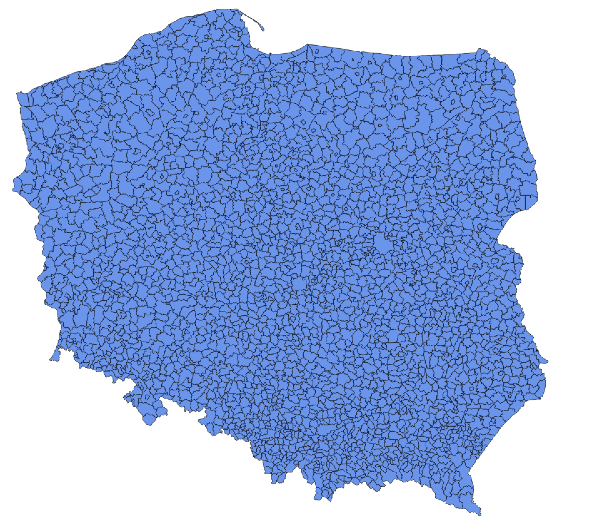
- **Various**: For alternate geometries, addition of `src:alt_label` property to each alt file (Issue [#1714](https://github.com/whosonfirst-data/whosonfirst-data/issues/1714))
  - **Fixed by**: multiple, for example [ro/#9](https://github.com/whosonfirst-data/whosonfirst-data-admin-ro/pull/9)
    - In order for Who's On First to property publish public SQLite distribution files, each "alt" file in Who's On First needed a `src:alt_label` property added.
    - Alt files in each of the 260 per-country Who's On First repositories were given this property in a series of pull requests.

### 2019 November

- **France**: Updated French `label:` properties in region records. Verifying and fixing each unique `"label:fra_x_preferred_longname"` property values for each of the 101 region records. (Issue [#1734](https://github.com/whosonfirst-data/whosonfirst-data/issues/1734))
- **Germany**: Updated the properties of two county records (Issue [#1697](https://github.com/whosonfirst-data/whosonfirst-data/issues/1697))
- **Honduras**: Updated the locality geometry of a locality in (Issue [#1736](https://github.com/whosonfirst-data/whosonfirst-data/issues/1736)):
- **India**: Updated administrative records in select localities in India (Issue [#1593](https://github.com/whosonfirst-data/whosonfirst-data/issues/1593))
  - This work is ongoing and will update neighbourhood, borough, locality, county, and region geometries in and around ten of the most populous localities in India. Two of the ten localities were updated this month, the remaining eight will be completed in December.
  - Specific work included:
    - Updating geometries for neighbourhood, borough, locality, county, and region records in Chandigarh and Kolkata
    - Updating properties for these records, including name translations, `mz:` property flags, and `wof:` properties
    - PIP work to update `wof:hierarchy` and `wof:parent_id` properties for all records
    - Validating all geometries using osgeo, validating all records using Who's On First's `go-whosonfirst-validate` tool
    - Completing PIP work to updating or confirming all `wof:hierarchy` properties for all records in the India admin repository
- **Norway**: Fixed incorrect concordances and name translations in a locality record (Issue [#1730](https://github.com/whosonfirst-data/whosonfirst-data/issues/1730))
- **Poland**: Minor updates to locality records (Issue [#1738](https://github.com/whosonfirst-data/whosonfirst-data/issues/1738))
- **United Kingdom**: Updated neighbourhood geometries in Glasgow, Scotland. Clipping existing geometries to the Glasgow locality geometry. Flagging each updated record with a `mz:is_current` property value of `1`. Storing existing geometries in alt-geometry files. (Issue [#1724](https://github.com/whosonfirst-data/whosonfirst-data/issues/1724))
- **Various**: Updated name translations in various locality records in countries including: Angola, Austria, Hungary, India, Lithuania, Poland, Spain, and the United States. (Issue [#1743](https://github.com/whosonfirst-data/whosonfirst-data/issues/1743))

### 2019 December

- **Brazil**: Update Portugese localized names of around 4,500 counties, and correct names of 3 (Issue [#1756](https://github.com/whosonfirst-data/whosonfirst-data/issues/1756))
- **Canada**: Update geometry of Quebec to high precision (Issue [#1719](https://github.com/whosonfirst-data/whosonfirst-data/issues/1719))
- **Costa Rica**: Correct Liverpool population and Wikidata concordance (Issue [#1759](https://github.com/whosonfirst-data/whosonfirst-data/issues/1759))
- **France**: Fix name translations of Barbas locality (Issue [#1747](https://github.com/whosonfirst-data/whosonfirst-data/issues/1747))
- **India**: Add additional 242,827 name localizations to 18,679 admin places across the following languages: English, Arabic, Bengali (IN), Bengali (BN), Gujarati, Hindi, Kannada, Malayalam, Marathi, Punjabi, Tamil, Telugu, Urdu (Issue [#1763](https://github.com/whosonfirst-data/whosonfirst-data/issues/1763)),
- **India**: Add polygons for "100" largest cities in India (Issue [#1592](https://github.com/whosonfirst-data/whosonfirst-data/issues/1592))
- **India**: Add detailed admin subdivisions for largest localities in India, including: Ahmedabad, Bangalore, Chandigarh, Chennai, Delhi, Hyderabad, Jaipur, Kolkata, Mumbai, and Pune. (Issue [#1593](https://github.com/whosonfirst-data/whosonfirst-data/issues/1593))
- **India**: Upgrade neighbourhood records in Hyderabad, India (Issue [#661](https://github.com/whosonfirst-data/whosonfirst-data/issues/661))
- **India**: Correct name of `wof:name` is "Nekowal" (from "Dadra and Nagar Haveli") (Issue [#1722](https://github.com/whosonfirst-data/whosonfirst-data/issues/1722))
- **United States**: Deprecate duplicate Washington DC record (Issue [#1758](https://github.com/whosonfirst-data/whosonfirst-data/issues/1758))
- **United States**: Fix names in South Park neighbourhood to Dogtown (Pull request  [#31](https://github.com/whosonfirst-data/whosonfirst-data-admin-us/pull/31))
- **Various**: For localization, add missing `wof:{lang}_x_*` property to macroregion, region, or macrocounty records (Issue [#1718](https://github.com/whosonfirst-data/whosonfirst-data/issues/1718))
- **Various**: Fix invalid JSON in single alt file (Issue [#1764](https://github.com/whosonfirst-data/whosonfirst-data/issues/1764))

## 2020

Jump to month: [January](#2020-January) • [February](#2020-February) • [March](#2020-March) • [April](#2020-April) • [May](#2020-May) • [June](#2020-June) • [July](#2020-July) • [August](#2020-August) • [September](#2020-September) • [October](#2020-October) • [November](#2020-November) • [December](#2020-December)

### 2020 highlights

- **Tooling**: [Write Field](https://writefield.nextzen.org/) launches as a basic web app for editing WOF records! Hat tip to [@iandees](https://github.com/iandees), thanks!
- **Tooling**: Generate licenses file from whosonfirst-sources, including large refactor and legal compliance audit (which we passed). (Issue [#1081](https://github.com/whosonfirst-data/whosonfirst-data/issues/1081))
- **Tooling**: SQLite distributions are kindly generated and hosted by [geocode.earth](https://geocode.earth/data/), from 2020 January
- **Tooling**: In SQLite distributions, alternate geometries are now included with a flag of `is_alt`, so filter by `is_alt` = `0` to confirm to UNIQUE constrains. (Issue [#1834](https://github.com/whosonfirst-data/whosonfirst-data/issues/1834) and [#1837](https://github.com/whosonfirst-data/whosonfirst-data/issues/1837))
- **Tooling**: Publish updated properties list JSON Issue. (Issue [#1836](https://github.com/whosonfirst-data/whosonfirst-data/issues/1836))
- **Global**: Import DigitalEnvoy concordances for `country`, `region`, `localadmin`, and `marketarea` records (eg `digitalenvoy:country_code`). (Issue [#1807](https://github.com/whosonfirst-data/whosonfirst-data/issues/1807))
- **Global**: Clean up records with a megacity tag (Issue [#701](https://github.com/whosonfirst-data/whosonfirst-data/issues/701))
- **Global**: Run wiki names script on "high priority" places. (Issue [#1821](https://github.com/whosonfirst-data/whosonfirst-data/issues/1821))
- **Australia**: Add campus records for National Parks and Forests, from Collaborative Australian Protected Areas Database (Issue [#1699](https://github.com/whosonfirst-data/whosonfirst-data/issues/1699))
- **Mexico**: Add campus records for National Parks and Forests, from Mexico's Comision Nacional de Areas Naturales Protegidas (Issue [#1699](https://github.com/whosonfirst-data/whosonfirst-data/issues/1699))
- **United States**: Add campus records for National Parks and Forests, from United States National Park Service (Issue [#1699](https://github.com/whosonfirst-data/whosonfirst-data/issues/1699))
- **United States**: Move locality points to campus for "Mobile Estate" features. (Pull request [us/#60](https://github.com/whosonfirst-data/whosonfirst-data-admin-us/pull/60))
- **Various**: Flag `coterminous` localities, counties, and regions for capital city (of country, of region, or very large locality population) records (Issue [#1906](https://github.com/whosonfirst-data/whosonfirst-data/issues/1906))
- **Various**: Flag `capital_of` and `capital` for region <> locality records in Australia, Canada, Denmark, France, Germany, India, Netherlands, New Zealand, Norway, Saudi Arabia, Sweden, United Arab Emirates, United Kingdom, United States (Issue [#58](https://github.com/whosonfirst-data/whosonfirst-data/issues/58))
- **Various**: Fix `ST_GeogFromGeoJSON` fails on a handful of country geometries. (Issue [#1819](https://github.com/whosonfirst-data/whosonfirst-data/issues/1819))
- **Country rebuilds complete**: Portugal, Romania, Estonia, New Zealand
- **Neighbourhoods**: Paris (France)

#### 2020 January

- **Brazil**: Add 5 macroregion records for statistical purposes (Issue [#1128](https://github.com/whosonfirst-data/whosonfirst-data/issues/1128))
- **Canada**: Add missing Alberta "unitary" counties around Edmonton, Calgary, and Drumheller to ensure continuous fabric (Issue [#1765](https://github.com/whosonfirst-data/whosonfirst-data/issues/1765))
- **Egypt**: Deprecate bunk "testing" locality (Issue [#1771](https://github.com/whosonfirst-data/whosonfirst-data/issues/1771))
- **India**: Resolve duplicate New Delhi locality (Issue [#1785](https://github.com/whosonfirst-data/whosonfirst-data/issues/1785))
- **India**: Fix Damunda and Laxmapur locality names (Issue [#1788](https://github.com/whosonfirst-data/whosonfirst-data/issues/1788))
- **India**: Correct neighbourhood records in Mumbai to have `hierarchy_label=1` (Issue [#1783](https://github.com/whosonfirst-data/whosonfirst-data/issues/1783))
- **Laos**: Add missing Nong district (Issue [#1782](https://github.com/whosonfirst-data/whosonfirst-data/issues/1782))
- **Portugal**: Cleanup regions to ensure Azores and Madeira have features; dissolve 4 existing region geometries into 2 region geometries (Issue [#1173](https://github.com/whosonfirst-data/whosonfirst-data/issues/1173))
- **Portugal**: Add ~5,000 localadmin level features in Portugal (Issue [#1740](https://github.com/whosonfirst-data/whosonfirst-data/issues/1740))
- **Serbia**: Fix Sabac locality name (Issue [#1781](https://github.com/whosonfirst-data/whosonfirst-data/issues/1781))
- **Venezuela**: Add missing Atures municipality (Issue [#1767](https://github.com/whosonfirst-data/whosonfirst-data/issues/1767))
- **Various**: Clean up records with a megacity tag (Issue [#701](https://github.com/whosonfirst-data/whosonfirst-data/issues/701))
- **Various**: Ensure megacities have `population` and `population_rank` (Issue [#797](https://github.com/whosonfirst-data/whosonfirst-data/issues/797))
- **Various**: SQLite distributions are kindly generated and hosted by [geocode.earth](https://geocode.earth/data/)

### 2020 February

- **Afghanistan**: Remove 2 funk temporary files from repo. (Issue [#1800](https://github.com/whosonfirst-data/whosonfirst-data/issues/1800))
- **India**: Update Place Zerakpur. (Pull request [in/#37](https://github.com/whosonfirst-data/whosonfirst-data-admin-in/pull/37))
- **Norway**: Update Norway regions and add new localadmin ("counties") to reflect 2020 boundary changes. (Issue [#1757](https://github.com/whosonfirst-data/whosonfirst-data/issues/1757))
- **Oman**: Add 2 missing country records. (Issue [#1773](https://github.com/whosonfirst-data/whosonfirst-data/issues/1773))
- **Switzerland**: Update Rothenburg. (Pull request [ch/#9](https://github.com/whosonfirst-data/whosonfirst-data-admin-ch/pull/9))
- **Various**: [Write Field](https://writefield.nextzen.org/) launches as a basic web app for editing WOF records! Hat tip to [@iandees](https://github.com/iandees), thanks!
- **Various**: Generate licenses file from whosonfirst-sources. (Issue [#1081](https://github.com/whosonfirst-data/whosonfirst-data/issues/1081))
- **Various**: Licensing information - link targets not available. (Issue [#1651](https://github.com/whosonfirst-data/whosonfirst-data/issues/1651))
- **Various**: Add back [LICENSE](https://github.com/whosonfirst-data/whosonfirst-data/blob/master/LICENSE.md) file as pointer. (Issue [#1795](https://github.com/whosonfirst-data/whosonfirst-data/issues/1795))

### 2020 March

- **Gambia**: Update names for Banjul. (Issue [#1802](https://github.com/whosonfirst-data/whosonfirst-data/issues/1802))
- **India**: Resolve Devli duplicate of Delhi. (Issue [#1784](https://github.com/whosonfirst-data/whosonfirst-data/issues/1784))
- **India**: Update Bajowali English and default names. (Pull request [in/#38](https://github.com/whosonfirst-data/whosonfirst-data-admin-in/pull/38))
- **India**: Update Chirak English and default names. (Pull request [in/#39](https://github.com/whosonfirst-data/whosonfirst-data-admin-in/pull/39))
- **Ireland**: Update Ballylusky English and default names. (Pull request [ie/#12](https://github.com/whosonfirst-data/whosonfirst-data-admin-ie/pull/12))
- **Italy**: Updates English, Italian, and French label properties on `region` records, population and src properties, and concordances. (Pull request [it/#14](https://github.com/whosonfirst-data/whosonfirst-data-admin-it/pull/14))
- **Norway**: Adds/updates `label` properties to Norway `region` records. Also updates `wof:lang*` properties in all `region` and `country` records. Corrects `name` property values, storing variant names when applicable. (Pull request [no/#13](https://github.com/whosonfirst-data/whosonfirst-data-admin-no/pull/13))
- **Poland**: Update Roznowo with English and Polish names. (Pull request [pl/#16](https://github.com/whosonfirst-data/whosonfirst-data-admin-pl/pull/16))
- **United Kingdom**: Update to ONS Feb 2020 data release for `postalcode` records. (Issue [#1685](https://github.com/whosonfirst-data/whosonfirst-data/issues/1685))
- **United States**: Update East Side, Kansas City neighbourhood. (Issue [#1789](https://github.com/whosonfirst-data/whosonfirst-data/issues/1789))
- **United States**: Update Minnewawa, MN English and default names. (Issue [#1799](https://github.com/whosonfirst-data/whosonfirst-data/issues/1799))
- **United States**: Update Place Shawnee. (Pull request [us/#49](https://github.com/whosonfirst-data/whosonfirst-data-admin-us/pull/49))
- **Various**: Import DigitalEnvoy concordances for `country`, `region`, `localadmin`, and `marketarea` records (eg `digitalenvoy:country_code`). (Issue [#1807](https://github.com/whosonfirst-data/whosonfirst-data/issues/1807))
- **Various**: Add `README` and `ISSUE_TEMPLATE` to all the new admin repos. (Issue [#1667](https://github.com/whosonfirst-data/whosonfirst-data/issues/1667))
- **Various**: Add `wof:repo` property to all alt files. (Issue [#1729](https://github.com/whosonfirst-data/whosonfirst-data/issues/1729))
- **Various**: Add missing `src:alt_label` properties. (Issue [#1804](https://github.com/whosonfirst-data/whosonfirst-data/issues/1804))
- **Various**: Add new `wof:geom_alt` property. (Issue [#1793](https://github.com/whosonfirst-data/whosonfirst-data/issues/1793))
- **Various**: Remove whosonfirst-data-{country code} repos as we went with different naming convention. (Issue [#1806](https://github.com/whosonfirst-data/whosonfirst-data/issues/1806))

### 2020 April

- **Afghanistan**: Update Fatah record to remove funky name translation. (Pull request [af/#11](https://github.com/whosonfirst-data/whosonfirst-data-admin-af/pull/11))
- **Czechia**: Add name and label localizations for 14 region records, in Czech and English. (Pull request [cz/#10](https://github.com/whosonfirst-data/whosonfirst-data-admin-cz/pull/10) related to issue [#1640](https://github.com/whosonfirst-data/whosonfirst-data/issues/1640))
- **Denmark**: Update Denmark region name translations and `wof:name` values. (Issue [#1453](https://github.com/whosonfirst-data/whosonfirst-data/issues/1453))
- **Germany**: Update Korzendorf record's German and English names. (Pull request [de/#24](https://github.com/whosonfirst-data/whosonfirst-data-admin-de/pull/24))
- **India**: Update Gandhuan record's default and English names. (Pull request [in/#42](https://github.com/whosonfirst-data/whosonfirst-data-admin-in/pull/42))
- **India**: Update Jhanbke record's default and English names. (Pull request [in/#43](https://github.com/whosonfirst-data/whosonfirst-data-admin-in/pull/43))
- **Italy**: Update Fie allo Sciliar to resolve funky `�` character in names. (Pull request [it/#18](https://github.com/whosonfirst-data/whosonfirst-data-admin-it/pull/18) related to issue  [#1830](https://github.com/whosonfirst-data/whosonfirst-data/issues/1830))
- **Norway**: Update Norway region name translations and `wof:name` values. (Issue [#1445](https://github.com/whosonfirst-data/whosonfirst-data/issues/1445))
- **Portugal**: Add name and label localizations for 18 region records, in Portuguese and English. (Pull request [pt/#11](https://github.com/whosonfirst-data/whosonfirst-data-admin-pt/pull/11) related to issue  [#1640](https://github.com/whosonfirst-data/whosonfirst-data/issues/1640))
- **Romania**: Add name and label localizations for 42 region records, in Romanian and English. (Pull request [ro/#13](https://github.com/whosonfirst-data/whosonfirst-data-admin-ro/pull/13) related to issue  [#1640](https://github.com/whosonfirst-data/whosonfirst-data/issues/1640))
- **Switzerland**: Update Schaffhausen record's English names. (Pull request [ch/#16](https://github.com/whosonfirst-data/whosonfirst-data-admin-ch/pull/16))
- **Ukraine**: Update Polyakhova reocrd to remove bad name variant. (Pull request [ua/#10](https://github.com/whosonfirst-data/whosonfirst-data-admin-ua/pull/10))
- **United States**: Resolve duplicate Kansas City, MO records. (Issue [#1791](https://github.com/whosonfirst-data/whosonfirst-data/issues/1791))
- **United States**: Update Cheektowasa record's default and English names. (Pull request [us/#55](https://github.com/whosonfirst-data/whosonfirst-data-admin-us/pull/55))
- **Various**: Run wiki names script on "high priority" places. (Issue [#1821](https://github.com/whosonfirst-data/whosonfirst-data/issues/1821))
- **Various**: Fix `ST_GeogFromGeoJSON` fails on a handful of country geometries. (Issue [#1819](https://github.com/whosonfirst-data/whosonfirst-data/issues/1819))
- **Various**: Add name translations to continent records. (Issue [#1818](https://github.com/whosonfirst-data/whosonfirst-data/issues/1818))
- **Various**: Fix Spratley Islands names and concordances. (Issue [#1459](https://github.com/whosonfirst-data/whosonfirst-data/issues/1459))
- **Various**: Update locality names for Schaffhausen, Bachowali, Charik, and Ballyhisky. (Issue [#1805](https://github.com/whosonfirst-data/whosonfirst-data/issues/1805))
- **Various**: Fix 2,031 cases of bunk new lines/whitespaces newline in `wof:name` values (this makes it easier to import into Postgres). (Issue [#1796](https://github.com/whosonfirst-data/whosonfirst-data/issues/1796))
- **Various**: Goodbye old Tempelhof Central Airport. (Pull request [xy/#18](https://github.com/whosonfirst-data/whosonfirst-data-admin-xy/pull/18))

### 2020 May

- **Australia**: Update Ulimambri. (Pull request [au/#23](https://github.com/whosonfirst-data/whosonfirst-data-admin-au/pull/23))
- **Canada**: Update Mayland Heights. (Pull request [ca/#21](https://github.com/whosonfirst-data/whosonfirst-data-admin-ca/pull/21))
- **Germany**: Update Kossenblatt. (Pull request [de/#26](https://github.com/whosonfirst-data/whosonfirst-data-admin-de/pull/26))
- **France**: Update name of Val d'Oise département (Issue [#1833](https://github.com/whosonfirst-data/whosonfirst-data/issues/1833))
- **France**: Update France region labels. (Pull request [fr/#32](https://github.com/whosonfirst-data/whosonfirst-data-admin-fr/pull/32))
- **France**: Update Baden. (Pull request [fr/#31](https://github.com/whosonfirst-data/whosonfirst-data-admin-fr/pull/31))
- **France**: Update Gilles. (Pull request [fr/#30](https://github.com/whosonfirst-data/whosonfirst-data-admin-fr/pull/30))
- **France**: Update Senones county name. (Pull request [fr/#28](https://github.com/whosonfirst-data/whosonfirst-data-admin-fr/pull/28))
- **France**: Update Senones locality name. (Pull request [fr/#29](https://github.com/whosonfirst-data/whosonfirst-data-admin-fr/pull/29))
- **India**: Update Korba geometry. (Pull request [in/#47](https://github.com/whosonfirst-data/whosonfirst-data-admin-in/pull/47))
- **India**: Update Bholapur. (Pull request [in/#52](https://github.com/whosonfirst-data/whosonfirst-data-admin-in/pull/52))
- **India**: Update Bilaur. (Pull request [in/#49](https://github.com/whosonfirst-data/whosonfirst-data-admin-in/pull/49))
- **India**: Update Bisrakh. (Pull request [in/#46](https://github.com/whosonfirst-data/whosonfirst-data-admin-in/pull/46))
- **India**: Update Mataura. (Pull request [in/#51](https://github.com/whosonfirst-data/whosonfirst-data-admin-in/pull/51))
- **India**: Update Pagrapalli. (Pull request [in/#50](https://github.com/whosonfirst-data/whosonfirst-data-admin-in/pull/50))
- **India**: Update Warli. (Pull request [in/#48](https://github.com/whosonfirst-data/whosonfirst-data-admin-in/pull/48))
- **India**: Update Yigavaripalem. (Pull request [in/#53](https://github.com/whosonfirst-data/whosonfirst-data-admin-in/pull/53))
- **Ireland**: Update Barinoney Cross Roads. (Pull request [ie/#16](https://github.com/whosonfirst-data/whosonfirst-data-admin-ie/pull/16))
- **Norway**: Update Grefsen. (Pull request [no/#16](https://github.com/whosonfirst-data/whosonfirst-data-admin-no/pull/16))
- **Turkey**: Update Savulca. (Pull request [tr/#13](https://github.com/whosonfirst-data/whosonfirst-data-admin-tr/pull/13))
- **United Kingdom**: Update Helston. (Pull request [gb/#27](https://github.com/whosonfirst-data/whosonfirst-data-admin-gb/pull/27))
- **United States**: Unincorporated community of Wayne, PA is missing. (Issue [#1831](https://github.com/whosonfirst-data/whosonfirst-data/issues/1831))
- **United States**: Move locality points to campus for "Mobile Estate" features. (Pull request [us/#60](https://github.com/whosonfirst-data/whosonfirst-data-admin-us/pull/60))
- **United States**: Update Champion. (Pull request [us/#58](https://github.com/whosonfirst-data/whosonfirst-data-admin-us/pull/58))
- **United States**: Update Tamega. (Pull request [us/#59](https://github.com/whosonfirst-data/whosonfirst-data-admin-us/pull/59))
- **Various**: In SQLite distributions, alternate geometries are now included with a flag of `is_alt`, so filter by `is_alt` = `0` to confirm to UNIQUE constrains. (Issue [#1834](https://github.com/whosonfirst-data/whosonfirst-data/issues/1834) and [#1837](https://github.com/whosonfirst-data/whosonfirst-data/issues/1837))
- **Various**: Publish updated properties list JSON Issue. (Issue [#1836](https://github.com/whosonfirst-data/whosonfirst-data/issues/1836))
- **Various**: Standardize on unknown source in various countries. (E.G. pull request [#62](https://github.com/whosonfirst-data/whosonfirst-data-admin-us/pull/62))

### 2020 June

- **Bahrain**: Untangle Manama properties (`superseded_by` and `supersedes`) (Issue [#1842](https://github.com/whosonfirst-data/whosonfirst-data/issues/1842))
- **Canada**: Untangle multiple Liverpool records with mixed up properties (Issue [#1860](https://github.com/whosonfirst-data/whosonfirst-data/issues/1860))
- **France**: Upgrade neighbourhood shapes for Paris neighbourhood (again) (Issue [#410](https://github.com/whosonfirst-data/whosonfirst-data/issues/410))
- **Germany**: Neighbourhood had bunk names and concordance (not that Eiffel Tower!) (Issue [#1852](https://github.com/whosonfirst-data/whosonfirst-data/issues/1852))
- **Martinique**: Deprecate the locality of Martinique as such a place doesn't exist (Issue [#1861](https://github.com/whosonfirst-data/whosonfirst-data/issues/1861))
- **Romania**: Add official data for localities, from Romanian National Agency for Cadastre and Land Registration (ANCPI) (Issue [#1741](https://github.com/whosonfirst-data/whosonfirst-data/issues/1741))
- **United States**: Paso Robles English name is 'El Paso de Robles', which is very formal (Issue [#1858](https://github.com/whosonfirst-data/whosonfirst-data/issues/1858))
- **United States**: Untangle multiple Liverpool records with mixed up properties (Issue [#1860](https://github.com/whosonfirst-data/whosonfirst-data/issues/1860))
- **Various**: Add back [README.KNOWN.KNOWNS.md](https://github.com/whosonfirst-data/whosonfirst-data/blob/master/README.KNOWN.KNOWNS.md) to main repo (casualty of big repo refactor) (Issue [#1853](https://github.com/whosonfirst-data/whosonfirst-data/issues/1853))
- **Various** other [edits](https://github.com/pulls?q=is%3Apr+user%3Awhosonfirst-data+archived%3Afalse+merged%3A2020-06-01..2020-06-30+is%3Aclosed+) made directly to the individual country repos as PRs...

### 2020 July

- **China**: Fix bunk characters in `wof:name` property (Issue [#1830](https://github.com/whosonfirst-data/whosonfirst-data/issues/1830))
- **Estonia**: Fix up regions by adding, deduplicating, retiring, and otherwise improving records, from Estonian Land Board (Issue [#1550](https://github.com/whosonfirst-data/whosonfirst-data/issues/1550) and [#25](https://github.com/whosonfirst-data/whosonfirst-data/issues/25))
- **Italy**: Fix bunk characters in `wof:name` property (Issue [#1830](https://github.com/whosonfirst-data/whosonfirst-data/issues/1830))
- **Mexico**: Resolve duplicate Rosarito localities (Issue [#1865](https://github.com/whosonfirst-data/whosonfirst-data/issues/1865))
- **United Kingdom**: Flag Liverpool, England county and locality as coterminous (Issue [#1868](https://github.com/whosonfirst-data/whosonfirst-data/issues/1868))
- **United States**: Untangle "Southern Tip" neighbourhood on Liberty Island (Issue [#1867](https://github.com/whosonfirst-data/whosonfirst-data/issues/1867))
- **United States**: Clean up shortcodes on New York city counties (Pull request [us/#61](https://github.com/whosonfirst-data/whosonfirst-data-admin-us/pull/61))
- **Various**: Add/verify population data on continent records (Issue [#1869](https://github.com/whosonfirst-data/whosonfirst-data/issues/1869))
- **Various**: Move a few records from one XX repo to another XX repo, for sanity's sake
- **Various** other [edits](https://github.com/pulls?q=is%3Apr+user%3Awhosonfirst-data+archived%3Afalse+merged%3A2020-07-01..2020-07-30+is%3Aclosed+) made directly to the individual country repos as PRs...

### 2020 August

- **Estonia**: Update admin records for county, localadmin, locality, borough, and neighbourhood placetypes (with coterminous as appropriate), from Estonian Land Board (Issue [#1825](https://github.com/whosonfirst-data/whosonfirst-data/issues/1825))
  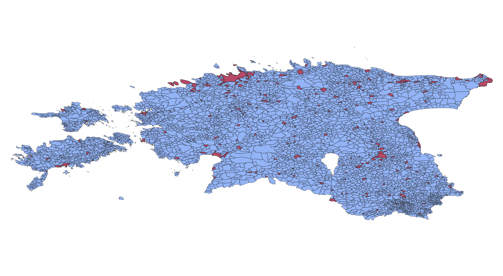
- **Greece**: Update Greek and English names in the Athens locality record, using to "script" and "region" variants property name options (Issue [#1877](https://github.com/whosonfirst-data/whosonfirst-data/issues/1877))
- **India**: Add missing locality record for Siddipet City (Issue [#1874](https://github.com/whosonfirst-data/whosonfirst-data/issues/1874))
- **Netherlands**: Untangle Hoek van Holland and Rotterdam records (related to `wof:superseded_by`) (Issue [#1863](https://github.com/whosonfirst-data/whosonfirst-data/issues/1863))
- **United States**: Add `is_landuse_aoi` properties to nine Seattle neighbourhoods that are bodies of water (Issue [#1862](https://github.com/whosonfirst-data/whosonfirst-data/issues/1862))
- **United States**: Resolve duplicate records for Litchfield Park (Arizona) and Gary (Indiana) (Issue [#1875](https://github.com/whosonfirst-data/whosonfirst-data/issues/1875))
- **Various**: 114 records had `wof:id` properties encoded as strings (oops) (Issue [#1845](https://github.com/whosonfirst-data/whosonfirst-data/issues/1845))
- **Various** other [edits](https://github.com/pulls?q=is%3Apr+user%3Awhosonfirst-data+archived%3Afalse+merged%3A2020-08-01..2020-08-31+is%3Aclosed+) made directly to the individual country repos as PRs...

### 2020 September

- **Australia**: Add campus records for National Parks and Forests, from Collaborative Australian Protected Areas Database (Issue [#1699](https://github.com/whosonfirst-data/whosonfirst-data/issues/1699))
- **Canada**: Add a locality record for Brigus Junction (Issue [#1744](https://github.com/whosonfirst-data/whosonfirst-data/issues/1744))
- **Canada**: Fix 6 locality that incorrectly had United States in country hierarchy (Issue [#1832](https://github.com/whosonfirst-data/whosonfirst-data/issues/1832))
- **Colombia**: Wrong name for Salgar (Issue [#1892](https://github.com/whosonfirst-data/whosonfirst-data/issues/1892))
- **Estonia**: Recent property fixes introduced invalid JSON for 133 records (Issue [#1891](https://github.com/whosonfirst-data/whosonfirst-data/issues/1891))
- **India**: Improve labels for regions in English (Issue [#1888](https://github.com/whosonfirst-data/whosonfirst-data/issues/1888))
- **Mexico**: Add campus records for National Parks and Forests, from Mexico's Comision Nacional de Areas Naturales Protegidas (Issue [#1699](https://github.com/whosonfirst-data/whosonfirst-data/issues/1699))
- **Sweden**: Fix duplicate locality records for Malmö (Issue [#1720](https://github.com/whosonfirst-data/whosonfirst-data/issues/1720))
- **Switzerland**: Add names to admin features, 12,417 names total over 4,983 records (Issue [#1686](https://github.com/whosonfirst-data/whosonfirst-data/issues/1686))
- **United States**: Resolve duplicate Flinton (Pennsylvania) records (Issue [#1835](https://github.com/whosonfirst-data/whosonfirst-data/issues/1835))
- **Various**: ID duplicated between xx and xy repos (also Israel and Estonia) (Issue [#1890](https://github.com/whosonfirst-data/whosonfirst-data/issues/1890))
- **Various**: Backfill `wof:name` to always be 7-bit ASCII (Issue [#183](https://github.com/whosonfirst-data/whosonfirst-data/issues/183))
- **Various** other [edits](https://github.com/pulls?q=is%3Apr+user%3Awhosonfirst-data+archived%3Afalse+merged%3A2020-09-01..2020-09-30+is%3Aclosed+) made directly to the individual country repos as PRs...

### 2020 October

- **Canada**: Duplicate preferred names for Quartier international de Montreal, Parc-de-la-Montagne, Mont-Bleu, and Mutchmore (Issue [#1898](https://github.com/whosonfirst-data/whosonfirst-data/issues/1898))
- **Egypt**: Add Arabic name translations to 294 county features (Issue [#1646](https://github.com/whosonfirst-data/whosonfirst-data/issues/1646))
- **Estonia**: Duplicate preferred names for Albacete (Issue [#1898](https://github.com/whosonfirst-data/whosonfirst-data/issues/1898))
- **Finland**: Update Savio neighbourhood to shrink it's polygon (Issue [#1750](https://github.com/whosonfirst-data/whosonfirst-data/issues/1750))
- **Germany**: Update Hochzeitsfeier record (not Wedding!) (Issue [#1894](https://github.com/whosonfirst-data/whosonfirst-data/issues/1894))
- **Greece**: Duplicate preferred names for Mount Athos (Issue [#1898](https://github.com/whosonfirst-data/whosonfirst-data/issues/1898))
- **Kosovo**: Update names and concordances in Isniq locality record (Issue [#1900](https://github.com/whosonfirst-data/whosonfirst-data/issues/1900))
- **Netherlands**: Duplicate preferred names for 87 features (Issue [#1898](https://github.com/whosonfirst-data/whosonfirst-data/issues/1898))
- **New Zealand**: Add new localities, from Fire and Emergency New Zealand (Issues [#1878](https://github.com/whosonfirst-data/whosonfirst-data/issues/1878), [#1811](https://github.com/whosonfirst-data/whosonfirst-data/issues/1811), [#1691](https://github.com/whosonfirst-data/whosonfirst-data/issues/1691), [#1056](https://github.com/whosonfirst-data/whosonfirst-data/issues/1056), and [#1848](https://github.com/whosonfirst-data/whosonfirst-data/issues/1848))
- **New Zealand**: Give Waitaki District, NZ a dual-hierarchy (Issue [#1056](https://github.com/whosonfirst-data/whosonfirst-data/issues/1056))
- **New Zealand**: New and updated marinearea records around New Zealand (Pull request [nz/#23](https://github.com/whosonfirst-data/whosonfirst-data-admin-xy/pull/23))
- **Pakistan**: Duplicate preferred names for Gilgit-Baltistan (Issue [#1898](https://github.com/whosonfirst-data/whosonfirst-data/issues/1898))
- **United States**: Add campus records for National Parks and Forests, from United States National Park Service (Issue [#1699](https://github.com/whosonfirst-data/whosonfirst-data/issues/1699))
- **United States**: Add population info to Chapel Hill locality record  (Pull request [us/#84](https://github.com/whosonfirst-data/whosonfirst-data-admin-us/pull/84))
- **United States**: Duplicate preferred names for SOSA, Morrison, and Huntersville (Issue [#1898](https://github.com/whosonfirst-data/whosonfirst-data/issues/1898))
- **Various** other [edits](https://github.com/pulls?q=is%3Apr+user%3Awhosonfirst-data+archived%3Afalse+merged%3A2020-10-01..2020-10-31+is%3Aclosed+) made directly to the individual country repos as PRs...

### 2020 November

- "Schönefeld To Become Part Of New Berlin Airport" airports (Issue [#1886](https://github.com/whosonfirst-data/whosonfirst-data/issues/1886))

### 2020 December

- **United Kingdom**: Untangle Widnes localadmin and locality records (Issue [#1907](https://github.com/whosonfirst-data/whosonfirst-data/issues/1907))
- **Romania**: Wrong translations for some localities in Bucharest / Ilfov (Issue [#1902](https://github.com/whosonfirst-data/whosonfirst-data/issues/1902))
- **Switzerland**: Fix 59 coastal municipalities that had lakes as parent localadmin (Issue [#1897](https://github.com/whosonfirst-data/whosonfirst-data/issues/1897))
- **Denmark**: Copenhagen localadmin had funky name translations (Issue [#1872](https://github.com/whosonfirst-data/whosonfirst-data/issues/1872))
- **Poland**: Correct "Greater Poland" region name translations (Issue [#1801](https://github.com/whosonfirst-data/whosonfirst-data/issues/1801))
- **Argentina**: Update region name translations and `wof:name` values (Issue [#1455](https://github.com/whosonfirst-data/whosonfirst-data/issues/1455))
- **Various**: Flag `coterminous` localities, counties, and regions for capital city (of country, of region, or very large locality population) records (Issue [#1906](https://github.com/whosonfirst-data/whosonfirst-data/issues/1906))
- **Various**: Flag `capital_of` and `capital` for region <> locality records in Australia, Canada, Denmark, France, Germany, India, Netherlands, New Zealand, Norway, Saudi Arabia, Sweden, United Arab Emirates, United Kingdom, United States (Issue [#58](https://github.com/whosonfirst-data/whosonfirst-data/issues/58))
- **Various** other [edits](https://github.com/pulls?q=is%3Apr+user%3Awhosonfirst-data+archived%3Afalse+merged%3A2020-12-01..2020-12-31+is%3Aclosed+) made directly to the individual country repos as PRs...

## 2021

Jump to month: [January](#2021-January) • [February](#2021-February) • [March](#2021-March) • [April](#2021-April) • [May](#2021-May) • [June](#2021-June) • [July](#2021-July) • [August](#2021-August) • [September](#2021-September) • [October](#2021-October) • [November](#2021-November) • [December](#2021-December)

### 2021 highlights

- **Various**: Give course polygon geometries to 590 "megacity" from Natural Earth's locality polygons. [blog post](https://www.whosonfirst.org/blog/2021/02/11/megacities/). (Issue [#1547](https://github.com/whosonfirst-data/whosonfirst-data/issues/1547))
- **North Macedonia**: Rename country from Macedonia (related to European Union's accession deal with Greece)  (Issue [#1653](https://github.com/whosonfirst-data/whosonfirst-data/issues/1653))
- **United States**: Add postal cities (add locality names on postalcode placetype features), with new `mz:postal_locality` (common), `mz:postal_locality_alt` (common), and `mz:postal_locality_funky` (limited to several examples) properties based on WOF venues data. (Issue [#202](https://github.com/whosonfirst-data/whosonfirst-data/issues/202) and discussion in [us/#5](https://github.com/whosonfirst-data/whosonfirst-data-postalcode-us/pull/5))
- **United States**: Resolve locality vis-a-vis localadmin conterminous places (Towns of Marthas Vineyard & etc), including updating to Census 2019 data, flag localadmin records in Indiana and Missouri as `mz:hierarchy_label` = 0, and create a few localadmin and locality `wof:statistical_gore` = 1 features to ensure continuous fabric of features. (Issue [#538](https://github.com/whosonfirst-data/whosonfirst-data/issues/538) and in [us/#86](https://github.com/whosonfirst-data/whosonfirst-data-admin-us/pull/86) and updated [property descriptions](https://github.com/whosonfirst/whosonfirst-properties/issues/104))
- **Various**: Add ITU phone dialing calling codes to country records (`itu:country_code` and `itu:region`) (Issue [#1929](https://github.com/whosonfirst-data/whosonfirst-data/issues/1929))
- **Various**: Ensure basic worldview / point-of-view features and geom consistency of country, dependency, and disputed features (needs more work to set the alt geoms with POV tags) (Issues [#1930](https://github.com/whosonfirst-data/whosonfirst-data/issues/1930), [#170](https://github.com/whosonfirst-data/whosonfirst-data/issues/170), [#1580](https://github.com/whosonfirst-data/whosonfirst-data/issues/1580), and [#1218](https://github.com/whosonfirst-data/whosonfirst-data/issues/1218))
  
- **Various**: Add localized label properties to admin1/admin2 (Issue [#1640](https://github.com/whosonfirst-data/whosonfirst-data/issues/1640))
- **Various**: Backfill airport campus name variant properties with IATA/ICAO codes (Issue [#1963](https://github.com/whosonfirst-data/whosonfirst-data/issues/1963))
- **Country rebuilds complete**: Kuwait, Qatar, Indonesia (partial), Singapore, South Korea (partial), Palestine (partial), Luxembourg, Ireland (full)
- **Neighbourhoods**: Saudi Arabia (Mecca and Riyadh)

### 2021 January

- **New Zealand**: Fix 5 bad locality records (Issue [#1920](https://github.com/whosonfirst-data/whosonfirst-data/issues/1920))
- **Philippines**: Remove `lbl:bbox` properties on megacity records (Issue [#1918](https://github.com/whosonfirst-data/whosonfirst-data/issues/1918))
- **United States**: Add postal cities (add locality names on postalcode placetype features), with new `mz:postal_locality` (common), `mz:postal_locality_alt` (common), and `mz:postal_locality_funky` (limited to several examples) properties based on WOF venues data. (Issue [#202](https://github.com/whosonfirst-data/whosonfirst-data/issues/202) and discussion in [us/#5](https://github.com/whosonfirst-data/whosonfirst-data-postalcode-us/pull/5))
- **Various**: Give course polygon geometries to 590 "megacity" from Natural Earth's locality polygons. [blog post](https://www.whosonfirst.org/blog/2021/02/11/megacities/). (Issue [#1547](https://github.com/whosonfirst-data/whosonfirst-data/issues/1547))
- **Various** other [edits](https://github.com/pulls?q=is%3Apr+user%3Awhosonfirst-data+archived%3Afalse+merged%3A2021-01-01..2021-01-31+is%3Aclosed+) made directly to the individual country repos as PRs...

### 2021 February

- **Brazil**: Small cities named São Paulo seem to have inherited the population of the big one (Issue [#1924](https://github.com/whosonfirst-data/whosonfirst-data/issues/1924))
- **Denmark**: Fix typo in Holbaek (Issue [#1925](https://github.com/whosonfirst-data/whosonfirst-data/issues/1925))
- **Kuwait**: Update 513 admin records across region, county, locality, neighbourhood, and campus placetypes (Issue [#1912](https://github.com/whosonfirst-data/whosonfirst-data/issues/1912))
- **Qatar**: Update 73 admin records across neighbourhoods and localities placetypes, with other general cleanup around Doha and Ar Rayyan (Issue [#1911](https://github.com/whosonfirst-data/whosonfirst-data/issues/1911))
- **United States**: Resolve locality vis-a-vis localadmin conterminous places (Towns of Marthas Vineyard & etc), including updating to Census 2019 data, flag localadmin records in Indiana and Missouri as `mz:hierarchy_label` = 0, and create a few localadmin and locality `wof:statistical_gore` = 1 features to ensure continuous fabric of features. (Issue [#538](https://github.com/whosonfirst-data/whosonfirst-data/issues/538) and in [us/#86](https://github.com/whosonfirst-data/whosonfirst-data-admin-us/pull/86) and updated [property descriptions](https://github.com/whosonfirst/whosonfirst-properties/issues/104))
- **Various**: Add ITU phone dialing calling codes to country records (`itu:country_code` and `itu:region`) (Issue [#1929](https://github.com/whosonfirst-data/whosonfirst-data/issues/1929))
- **Various** other [edits](https://github.com/pulls?q=is%3Apr+user%3Awhosonfirst-data+archived%3Afalse+merged%3A2021-02-01..2021-02-28+is%3Aclosed+) made directly to the individual country repos as PRs...

### 2021 March

- **Indonesia**: Fix up locality polygons (needs more work) and add custom neighbourhood polygon coverage in Surabaya and Jakarta (Issue [#1903](https://github.com/whosonfirst-data/whosonfirst-data/issues/1903))
- **Singapore**: Updates admin records across country, region, county, locality, borough, macrohood, and neighbourhood placetypes, from Singapore Open Data Portal. (Issue [#1109](https://github.com/whosonfirst-data/whosonfirst-data/issues/1109) and [#1092](https://github.com/whosonfirst-data/whosonfirst-data/issues/1092))
- **Various**: Ensure basic worldview / point-of-view features and geom consistency of country, dependency, and disputed features (needs more work to set the alt geoms with POV tags) (Issues [#1930](https://github.com/whosonfirst-data/whosonfirst-data/issues/1930), [#170](https://github.com/whosonfirst-data/whosonfirst-data/issues/170), [#1580](https://github.com/whosonfirst-data/whosonfirst-data/issues/1580), and [#1218](https://github.com/whosonfirst-data/whosonfirst-data/issues/1218))
- **Various** other [edits](https://github.com/pulls?q=is%3Apr+user%3Awhosonfirst-data+archived%3Afalse+merged%3A2021-03-01..2021-03-31+is%3Aclosed+) made directly to the individual country repos as PRs...

### 2021 April

- **Albania**: Add Kukes International Airport (Issue [#1938](https://github.com/whosonfirst-data/whosonfirst-data/issues/1938))
- **South Korea**: Update and add localized labels and populations to 267 region and county features (Issue [#1454](https://github.com/whosonfirst-data/whosonfirst-data/issues/1454))
- **United Arab Emirates**: Update locality geometries when record is coterminous with parent (Issue [#1939](https://github.com/whosonfirst-data/whosonfirst-data/issues/1939))
- **United Arab Emirates**: County of Al Gharba was renamed (Al Dhafra) (Issue [#1932](https://github.com/whosonfirst-data/whosonfirst-data/issues/1932))
- **United Kingdom**: Harlesdon neighborhood should be named Harlesden (Issue [#1933](https://github.com/whosonfirst-data/whosonfirst-data/issues/1933))
- **Various** other [edits](https://github.com/pulls?q=is%3Apr+user%3Awhosonfirst-data+archived%3Afalse+merged%3A2021-04-01..2021-04-30+is%3Aclosed+) made directly to the individual country repos as PRs...

### 2021 May

- **Palestine**: Update around 1,102 localities records by resolving exploded multi-part features (Issue [#1627](https://github.com/whosonfirst-data/whosonfirst-data/issues/1627))
- **Various** other [edits](https://github.com/pulls?q=is%3Apr+user%3Awhosonfirst-data+archived%3Afalse+merged%3A2021-05-01..2021-05-31+is%3Aclosed+) made directly to the individual country repos as PRs (around 34)...

### 2021 June

- **Germany**: Untangle coterminous records for Bremen (Issue [#1945](https://github.com/whosonfirst-data/whosonfirst-data/issues/1945))
- **Indonesia**: Update labels, names, and concordances in region records (Issue [#1448](https://github.com/whosonfirst-data/whosonfirst-data/issues/1448))
- **Poland**: County Poznan appears incorrectly as "Loredan Popa" (Issue [#1943](https://github.com/whosonfirst-data/whosonfirst-data/issues/1943))
- **Switzerland**: Update translations, centroids, etc in 31 locality records (Issue [#1931](https://github.com/whosonfirst-data/whosonfirst-data/issues/1931))
- **Oceans**: Confirm WOF already has Southern Ocean record (Issue [#1944](https://github.com/whosonfirst-data/whosonfirst-data/issues/1944))
- **Various** other [edits](https://github.com/pulls?q=is%3Apr+user%3Awhosonfirst-data+archived%3Afalse+merged%3A2021-06-01..2021-06-30+is%3Aclosed+) made directly to the individual country repos as PRs...

### 2021 July

- **Luxembourg**: Admin updates across region, localadmin, locality, and neighbourhood placetypes, from Digital Lëtzebuerg (Issue [#1149](https://github.com/whosonfirst-data/whosonfirst-data/issues/1149) and [#1948](https://github.com/whosonfirst-data/whosonfirst-data/issues/1948))
- **Mexico**: Update Spanish and English names (Pull request [mx/#18](https://github.com/whosonfirst-data/whosonfirst-data-admin-mx/pull/18))
- **Philippines**: Backfill English and Tagalog names on regions and counties (Pull request [ph/#16](https://github.com/whosonfirst-data/whosonfirst-data-admin-ph/pull/16))
- **United States**: Wrong population figure for Detroit (Illinois) versus the one in Michigan (Issue [#1951](https://github.com/whosonfirst-data/whosonfirst-data/issues/1951))
- **Various** other [edits](https://github.com/pulls?q=is%3Apr+user%3Awhosonfirst-data+archived%3Afalse+merged%3A2021-07-01..2021-07-30+is%3Aclosed+) made directly to the individual country repos as PRs...

### 2021 August

- **Saudi Arabia**: Update neighbourhoods in Mecca (Issue [#1955](https://github.com/whosonfirst-data/whosonfirst-data/issues/1955))
- **Saudi Arabia**: Update Riyadh neighbourhoods (Issue [#1952](https://github.com/whosonfirst-data/whosonfirst-data/issues/1952))
- **United States**: Incorrect region in the hierarchy on Kennett, MO (Issue [#1889](https://github.com/whosonfirst-data/whosonfirst-data/issues/1889))
- **United States**: Neighbourhood "Usa" actually referrs to University of South Alabama (Issue [#1959](https://github.com/whosonfirst-data/whosonfirst-data/issues/1959))
- **United States**: Communications Hill, San Jose, CA boundary is a construction site, not the neighborhood (Issue [#1787](https://github.com/whosonfirst-data/whosonfirst-data/issues/1787))
- **Various**: Add localized label properties to admin1/admin2 (Issue [#1640](https://github.com/whosonfirst-data/whosonfirst-data/issues/1640))
- **Various** other [edits](https://github.com/pulls?q=is%3Apr+user%3Awhosonfirst-data+archived%3Afalse+merged%3A2021-08-01..2021-08-31+is%3Aclosed+) made directly to the individual country repos as PRs...

### 2021 September

- **North Macedonia**: Rename country from Macedonia (related to European Union's accession deal with Greece)  (Issue [#1653](https://github.com/whosonfirst-data/whosonfirst-data/issues/1653))
- **South Korea**: Update 3 neighbourhood records around Yongin (Issue [#1916](https://github.com/whosonfirst-data/whosonfirst-data/issues/1916))
- **United States**: Correct spelling of Parnassus neighbourhood in San Francisco (California) (Issue [#1962](https://github.com/whosonfirst-data/whosonfirst-data/issues/1962))
- **Various**: Backfill airport campus name variant properties with IATA/ICAO codes (Issue [#1963](https://github.com/whosonfirst-data/whosonfirst-data/issues/1963))
- **Various** other [edits](https://github.com/pulls?q=is%3Apr+user%3Awhosonfirst-data+archived%3Afalse+merged%3A2021-09-01..2021-09-30+is%3Aclosed+) made directly to the individual country repos as PRs...

### 2021 October

- **Portugal**: Updates 56 neighbourhoods in Porto (Issue [#1949](https://github.com/whosonfirst-data/whosonfirst-data/issues/1949))
- **United Arab Emirates**: Add new Expo locality (Pull request [ae/#24](https://github.com/whosonfirst-data/whosonfirst-data-admin-ae/pull/24)
- **Various**: Move all disputed areas to XY repo and cleanup their names, including validating against Natural Earth, and setting controlled hierarchies (Issue [#6](https://github.com/whosonfirst-data/whosonfirst-data/issues/6))
- **Various** other [edits](https://github.com/pulls?q=is%3Apr+user%3Awhosonfirst-data+archived%3Afalse+merged%3A2021-10-01..2021-10-31+is%3Aclosed+) made directly to the individual country repos as PRs...

### 2021 November

- **Greece**: Merge multi-part polygon records for Athens (Issue [#733](https://github.com/whosonfirst-data/whosonfirst-data/issues/733) and [#711](https://github.com/whosonfirst-data/whosonfirst-data/issues/711))
- **Indonesia**: Update region name translations and `wof:name` values (Issue [#1448](https://github.com/whosonfirst-data/whosonfirst-data/issues/1448))
- **St. Pierre and Miquelon**: Untangle records for dependency, region, and locality placetypes (Issue [#1843](https://github.com/whosonfirst-data/whosonfirst-data/issues/1843))
- **United States**: Charlotte (North Carolina) was missing population rank (Issue [#1633](https://github.com/whosonfirst-data/whosonfirst-data/issues/1633))
- **United States**: Deprecate Art Institute of Chicago venue (Illinois) (Issue [#1970](https://github.com/whosonfirst-data/whosonfirst-data/issues/1970))
- **United States**: Update Stapleton neighbourhood name (Central Park) (Issue [#1968](https://github.com/whosonfirst-data/whosonfirst-data/issues/1968))
- **Various**: Import more name translations from Natural Earth version 5 (Issue [#1961](https://github.com/whosonfirst-data/whosonfirst-data/issues/1961))
- **Various** other [edits](https://github.com/pulls?q=is%3Apr+user%3Awhosonfirst-data+archived%3Afalse+merged%3A2021-11-01..2021-11-30+is%3Aclosed+) made directly to the individual country repos as PRs...

### 2021 December

- **Albania**: Add missing locality of Divjakë (Issue [#1822](https://github.com/whosonfirst-data/whosonfirst-data/issues/1822))
- **Finland**: Update region geometries for Northern Ostrobothnia and Kainuu (Issue [#1499](https://github.com/whosonfirst-data/whosonfirst-data/issues/1499))
- **France**: Resolve duplicate features between France and Guadalupe (Issue [#726](https://github.com/whosonfirst-data/whosonfirst-data/issues/726))
- **Ireland**: Admin updates across region, county, localadmin, and locality records, with particular care around Dublin, Galway, and Cork, from Ordnance Survey Ireland. (Issue [#1443](https://github.com/whosonfirst-data/whosonfirst-data/issues/1443), [#1238](https://github.com/whosonfirst-data/whosonfirst-data/issues/1238), [#1134](https://github.com/whosonfirst-data/whosonfirst-data/issues/1443) and [#1849](https://github.com/whosonfirst-data/whosonfirst-data/issues/1849))
- **Ireland**: Fix invalid json (with initial discussion of adding GitHub actions to ensure future validations) (Issue [#1989](https://github.com/whosonfirst-data/whosonfirst-data/issues/1989))
- **Puerto Rico**: Update dependency geometry (Issue [#1780](https://github.com/whosonfirst-data/whosonfirst-data/issues/1780))
- **United States**: Add cessation date and mark San Francisco (Minnesota) ghost town as non-current (Issue [#1987](https://github.com/whosonfirst-data/whosonfirst-data/issues/1987))
- **United States**: Deprecate funky neighbourhood record in Detroit (Issue [#1515](https://github.com/whosonfirst-data/whosonfirst-data/issues/1515))
- **United States**: Sort out multiple records for Cleveland Museum of Art venue (Issue [#1978](https://github.com/whosonfirst-data/whosonfirst-data/issues/1978))
- **Various** other [edits](https://github.com/pulls?q=is%3Apr+user%3Awhosonfirst-data+archived%3Afalse+merged%3A2021-12-01..2021-12-31+is%3Aclosed+) made directly to the individual country repos as PRs...

## 2022

Jump to month: [January](#2022-January) • [February](#2022-February) • [March](#2022-March) • [April](#2022-April) • [May](#2022-May) • [June](#2022-June) • [July](#2022-July) • [August](#2022-August) • [September](#2022-September) • [October](#2022-October) • [November](#2022-November) • [December](#2022-December)

### 2022 highlights

- **India**: Update locality records to draw polygon geometries for 1,550 largest population localities (and all localities over 50k people, and all region and county capitals), including making new records (and deprecating some others), and adjusting neighbourhoods as appropriate, and unsetting any other Quattroshapes popcorn shaped default geoms to point geoms (Issue [#2005](https://github.com/whosonfirst-data/whosonfirst-data/issues/2005), [#1855](https://github.com/whosonfirst-data/whosonfirst-data/issues/1855), and [#1838](https://github.com/whosonfirst-data/whosonfirst-data/issues/1838))
- **Japan**: Revise 5k+ neighbourhood zoom levels so they show up in later zooms only, and add borough records in Tokyo (Issue [#1990](https://github.com/whosonfirst-data/whosonfirst-data/issues/1990))
- **United Kingdom**: Update postalcode records to August 2022 official release. (Pull request [postalcode-gb/#8](https://github.com/whosonfirst-data/whosonfirst-data-postalcode-gb/pull/8))
- **Various**: Fix some admin records geoms that were still invalid when importing them into Elasticsearch geometry, including in including Finland, Ireland, Argentina, and United Arab Emirates (Issue [#975](https://github.com/whosonfirst-data/whosonfirst-data/issues/975))
- **Country rebuilds complete**: South Africa, Pakistan (partial), Saudi Arabia (partial), United Arab Emirates (partial), Iraq (partial), Morocco (partial), Nigeria (partial), Spain (partial in Catalonia)
- **Neighbourhoods**: United States (Salt Lake City)

### 2022 January

- **Japan**: Revise 5k+ neighbourhood zoom levels so they show up in later zooms only, and add borough records in Tokyo (Issue [#1990](https://github.com/whosonfirst-data/whosonfirst-data/issues/1990))
- **Russia**: Add missing Ingushetia region, clips 2 neighboring regions of North Ossetia-Alania and Chechnya, correct some `src:geom` properties for other region and county records  (Issue [#1398](https://github.com/whosonfirst-data/whosonfirst-data/issues/1398) and [#1579](https://github.com/whosonfirst-data/whosonfirst-data/issues/1579))
- **Various**: Fix some adminrecords geoms that were still invalid when importing them into Elasticsearch geometry, including in including Finland, Ireland, Argentina, and United Arab Emirates (Issue [#975](https://github.com/whosonfirst-data/whosonfirst-data/issues/975))
- **Various**: ~20 [edits](https://github.com/pulls?q=is%3Apr+user%3Awhosonfirst-data+archived%3Afalse+merged%3A2022-01-01..2022-01-31+is%3Aclosed+) made directly to the individual country repos as PRs...

### 2022 February

- A quiet month
- **Various**: ~20 [edits](https://github.com/pulls?q=is%3Apr+user%3Awhosonfirst-data+archived%3Afalse+merged%3A2022-02-01..2022-02-28+is%3Aclosed+) made directly to the individual country repos as PRs...

### 2022 March

- **India**: Update 7 county records around Delhi with better names (Issue [#1995](https://github.com/whosonfirst-data/whosonfirst-data/issues/1995))
- **South Africa**: Update features across county, localadmin, locality and neighbourhood placetypes, with conterminous as appropriate, from South Africa Municipal Demarcation Board. (Issue [#1991](https://github.com/whosonfirst-data/whosonfirst-data/issues/1991))
- **Various**: ~5 [edits](https://github.com/pulls?q=is%3Apr+user%3Awhosonfirst-data+archived%3Afalse+merged%3A2022-03-01..2022-03-31+is%3Aclosed+) made directly to the individual country repos as PRs...

### 2022 April

- A quiet month
- **Various**: ~8 [edits](https://github.com/pulls?q=is%3Apr+user%3Awhosonfirst-data+archived%3Afalse+merged%3A2022-04-01..2022-04-30+is%3Aclosed+) made directly to the individual country repos as PRs...

### 2022 May

- **Germany**: Untangle Berlin localities (Pull request [de/#65](https://github.com/whosonfirst-data/whosonfirst-data-admin-de/pull/65))
- **United Kingdom**: Update Falkland Islands names. (Pull request [gb/#63](https://github.com/whosonfirst-data/whosonfirst-data-admin-gb/pull/63))
- **Various**: ~9 [edits](https://github.com/pulls?q=is%3Apr+user%3Awhosonfirst-data+archived%3Afalse+merged%3A2022-05-01..2022-05-31+is%3Aclosed+) made directly to the individual country repos as PRs...

### 2022 June

- **Germany**: Fix invalid lang tag formatting in for Balderschwang (Issue [#2003](https://github.com/whosonfirst-data/whosonfirst-data/issues/2003))
- **Indian Ocean**: Update Spanish names (Pull request [xy/#30](https://github.com/whosonfirst-data/whosonfirst-data-admin-xy/pull/30))
- **Various**: ~2 [edits](https://github.com/pulls?q=is%3Apr+user%3Awhosonfirst-data+archived%3Afalse+merged%3A2022-06-01..2022-06-30+is%3Aclosed+) made directly to the individual country repos as PRs...

### 2022 July

- **Japan**: Fix invalid concordance source for Kansai International Airport campus record (Issue [#2006](https://github.com/whosonfirst-data/whosonfirst-data/issues/2006))
- **India**: Update locality records to draw polygon geometries for 1,550 largest population localities (and all localities over 50k people, and all region and county capitals), including making new records (and deprecating some others), and adjusting neighbourhoods as appropriate, and unsetting any other Quattroshapes popcorn shaped default geoms to point geoms (Issue [#2005](https://github.com/whosonfirst-data/whosonfirst-data/issues/2005), [#1855](https://github.com/whosonfirst-data/whosonfirst-data/issues/1855), and [#1838](https://github.com/whosonfirst-data/whosonfirst-data/issues/1838))
- **United States**: Adjust 2 neighbourhood records in New York city (New York) to be on land instead of the water (Pull request [us/#132](https://github.com/whosonfirst-data/whosonfirst-data-admin-us/pull/132))
- **Various**: ~1 [edits](https://github.com/pulls?q=is%3Apr+user%3Awhosonfirst-data+archived%3Afalse+merged%3A2022-07-01..2022-07-30+is%3Aclosed+) made directly to the individual country repos as PRs...

### 2022 August

- **Australia**: Add missing Yarrabilba (Queensland) locality, including good discussion on how to make more complicated single feature imports to Who's On First (Issue [#2004](https://github.com/whosonfirst-data/whosonfirst-data/issues/2004))
- **Pakistan**: Update 430+ locality, 1100+ neighbourhood records, and more names for same (Issue [#1735](https://github.com/whosonfirst-data/whosonfirst-data/issues/1735))
- **Saudi Arabia**: Update 513 records to add polygon to largest localities and add neighbourhoods in major cities, with name localizations (Issue [#1909](https://github.com/whosonfirst-data/whosonfirst-data/issues/1909))
- **Taiwan**: Update zho names in Taiwan macroregion and country records (Pull request [tw/#16](https://github.com/whosonfirst-data/whosonfirst-data-admin-tw/pull/16))
- **United States**: Update ~ 260 neighbourhoods and microhoods (marking some as dprecated) in Salt Lake City, with centroid updates (Issue [#1746](https://github.com/whosonfirst-data/whosonfirst-data/issues/1746))
- **Various**: ~27 [edits](https://github.com/pulls?q=is%3Apr+user%3Awhosonfirst-data+archived%3Afalse+merged%3A2022-08-01..2022-08-31+is%3Aclosed+) made directly to the individual country repos as PRs...

### 2022 September

- **India**: Add 5 missing localities (Issue [#1855](https://github.com/whosonfirst-data/whosonfirst-data/issues/1855))
- **United Arab Emirates**: Add and update 1,018 features across locality and neighbourhood placetypes, including geometry cleanup along coastline and Arabic and English name localizaitons and review of "leftover" point geometries. (Issue [#2010](https://github.com/whosonfirst-data/whosonfirst-data/issues/2010))
  
- **United Kingdom**: Update postalcode records to May 2020 official release. (Pull request [postalcode-gb/#6](https://github.com/whosonfirst-data/whosonfirst-data-postalcode-gb/pull/6))
- **United Kingdom**: Update postalcode records to August 2021 official release. (Pull request [postalcode-gb/#7](https://github.com/whosonfirst-data/whosonfirst-data-postalcode-gb/pull/7))
- **United Kingdom**: Update postalcode records to August 2022 official release. (Pull request [postalcode-gb/#8](https://github.com/whosonfirst-data/whosonfirst-data-postalcode-gb/pull/8))
- **Various**: ~3 [edits](https://github.com/pulls?q=is%3Apr+user%3Awhosonfirst-data+archived%3Afalse+merged%3A2022-09-01..2022-09-30+is%3Aclosed+) made directly to the individual country repos as PRs...

### 2022 October

- **India**: Darjeeling had in incorrect longitude (Issue [#2012](https://github.com/whosonfirst-data/whosonfirst-data/issues/2012))
- **Iraq**: Update and add 1,130 records for neighbourhoods as polygons in Baghdad and adjust locality of the capital (and few othe major localities), with name updates (Issue [#1910](https://github.com/whosonfirst-data/whosonfirst-data/issues/1910))
- **Taiwan**: Update Taiwan name properties (Pull request [tw/#17](https://github.com/whosonfirst-data/whosonfirst-data-admin-tw/pull/17) and [tw/#19](https://github.com/whosonfirst-data/whosonfirst-data-admin-tw/pull/19))
- **Taiwan**: Update Taiwan name properties (Pull request [xx/#21](https://github.com/whosonfirst-data/whosonfirst-data-admin-xx/pull/21))
- **Various**: ~16 [edits](https://github.com/pulls?q=is%3Apr+user%3Awhosonfirst-data+archived%3Afalse+merged%3A2022-10-01..2022-10-31+is%3Aclosed+) made directly to the individual country repos as PRs...

### 2022 November

- **Morocco**: Updates regions to match 2015 redistricting, adds polygon geoms to ~200 locality, ensures any former locality points in new locality polygons are marked as neighbourhoods instead (Issue [#1164](https://github.com/whosonfirst-data/whosonfirst-data/issues/1164) and [#302](https://github.com/whosonfirst-data/whosonfirst-data/issues/302))
- **Nigeria**: Update and/or add 4,073 localities country-wide and neighbourhoods in Lagos, including demoting some GeoNames.org sourced localities to neighbourhoods. (Issue [#2015](https://github.com/whosonfirst-data/whosonfirst-data/issues/2015))
- **Poland**: Updates 300 locality records adding polygons and adding 10 missing localities, however additional work should be done via [#2011](https://github.com/whosonfirst-data/whosonfirst-data/issues/2011). (Issue [#1934](https://github.com/whosonfirst-data/whosonfirst-data/issues/1934))
- **Various**: ~3 [edits](https://github.com/pulls?q=is%3Apr+user%3Awhosonfirst-data+archived%3Afalse+merged%3A2022-11-01..2022-11-30+is%3Aclosed+) made directly to the individual country repos as PRs...

### 2022 December

- **Morocco**: Add extra names and Wikidata concordance to Laayoune (Issue [#302](https://github.com/whosonfirst-data/whosonfirst-data/issues/302))
- **Spain**: Update admin data in Catalonia at county and localadmin placetypes for geometries and names, from Institut Cartogràfic i Geològic de Catalunya (Issue [#1613](https://github.com/whosonfirst-data/whosonfirst-data/issues/1613))
- **Various**: ~2 [edits](https://github.com/pulls?q=is%3Apr+user%3Awhosonfirst-data+archived%3Afalse+merged%3A2022-12-01..2022-12-31+is%3Aclosed+) made directly to the individual country repos as PRs...

## 2023

Jump to month: [January](#2023-January) • [February](#2023-February) • [March](#2023-March) • [April](#2023-April) • [May](#2023-May) • [June](#2023-June) • [July](#2023-July) • [August](#2023-August) • [September](#2023-September) • [October](#2023-October) • [November](#2023-November) • [December](#2023-December)

### 2023 highlights

- **In Progress**: Massive import of locality records in India (Issue [#2027](https://github.com/whosonfirst-data/whosonfirst-data/issues/2027))
- **India**: Update Jammu and Kashmir union territory and Ladakh regions and disputed records, per internal admin changes in India (Issue [#1690](https://github.com/whosonfirst-data/whosonfirst-data/issues/1690))
- **United Kingdom**: Update postalcode records to November 2022 official release. (Pull request [postalcode-gb/#10](https://github.com/whosonfirst-data/whosonfirst-data-postalcode-gb/pull/10))
- **Country rebuilds complete**: India (partial, in-progress)
- **Neighbourhoods**: Italy (Rome), Turkey (Istanbul)

### 2023 January

- **Monaco**: Adjust label point for country to be in the country (Issue [#2020](https://github.com/whosonfirst-data/whosonfirst-data/issues/2020))
- **Germany**: Wenigumstadt property and hierarchy updates (Issue [#1998](https://github.com/whosonfirst-data/whosonfirst-data/issues/1998))
- **India**: Update Jammu and Kashmir union territory and Ladakh regions and disputed records, per internal admin changes in India (Issue [#1690](https://github.com/whosonfirst-data/whosonfirst-data/issues/1690))
- **United Kingdom**: Update postalcode records to November 2022 official release. (Pull request [postalcode-gb/#10](https://github.com/whosonfirst-data/whosonfirst-data-postalcode-gb/pull/10))
- **Various**: ~6 [edits](https://github.com/pulls?q=is%3Apr+user%3Awhosonfirst-data+archived%3Afalse+merged%3A2022-01-01..2022-01-31+is%3Aclosed+) made directly to the individual country repos as PRs...

### 2023 February

- **Austria**: Encoding problem with umlaut (special vowls) (Issue [#2022](https://github.com/whosonfirst-data/whosonfirst-data/issues/2022))
- **Germany**: Encoding problem with umlaut (special vowls) (Issue [#2022](https://github.com/whosonfirst-data/whosonfirst-data/issues/2022))
- **Germany**: DE Wrong supersede for Forchheim (Issue [#2023](https://github.com/whosonfirst-data/whosonfirst-data/issues/2023))
- **Italy**: Upgrade neighbourhood shapes for Rome neighbourhood (Issue [#420](https://github.com/whosonfirst-data/whosonfirst-data/issues/420))
- **Oceans**: Update French name properties on ocean records. (Pull request [xy/#31](https://github.com/whosonfirst-data/whosonfirst-data-admin-xy/pull/31))
- **Various**: ~5 [edits](https://github.com/pulls?q=is%3Apr+user%3Awhosonfirst-data+archived%3Afalse+merged%3A2022-02-01..2022-02-28+is%3Aclosed+) made directly to the individual country repos as PRs...

### 2023 March

- **Germany**: Resolve funky duplicate Hamburg locality record (Issue [#2030](https://github.com/whosonfirst-data/whosonfirst-data/issues/2030))
- **Germany**: Untangle Scharding and Vornbach records (Issue [#2028](https://github.com/whosonfirst-data/whosonfirst-data/issues/2028))
- **Turkey**: Update and/or add ~1,760 neighbourhoods of Istanbul, with appropriate adjustments to impacted locality points, and coastline cleanup of country and locality features (Issue [#1737](https://github.com/whosonfirst-data/whosonfirst-data/issues/1737))
- **United States**: Adjust Swedish preferred name (Issue [#2037](https://github.com/whosonfirst-data/whosonfirst-data/issues/2037))
- **United States**: Correct top-level ids and property types in three airport campus records (Issue [#2001](https://github.com/whosonfirst-data/whosonfirst-data/issues/2001) and [#2002](https://github.com/whosonfirst-data/whosonfirst-data/issues/2002))
- **Various**: Release up-to-date data distributions (Issue [#1661](https://github.com/whosonfirst-data/whosonfirst-data/issues/1661))
- **Various**: ~14 [edits](https://github.com/pulls?q=is%3Apr+user%3Awhosonfirst-data+archived%3Afalse+merged%3A2022-03-01..2022-03-31+is%3Aclosed+) made directly to the individual country repos as PRs...

### 2023 April

- A quiet month
- **Various**: 8 [edits](https://github.com/pulls?q=is%3Apr+user%3Awhosonfirst-data+archived%3Afalse+merged%3A2022-04-01..2022-04-30+is%3Aclosed+) made directly to the individual country repos as PRs...

### 2023 May

- **Germany**: Superseding fix for Berlin (Pull request [de/#65](https://github.com/whosonfirst-data/whosonfirst-data-admin-de/pull/65))
- **United Kingdom**: Update neighbourhood names and translations (Pull request [gb/#64](https://github.com/whosonfirst-data/whosonfirst-data-admin-gb/pull/64))
- **Various**: 9 [edits](https://github.com/pulls?q=is%3Apr+user%3Awhosonfirst-data+archived%3Afalse+merged%3A2022-05-01..2022-05-31+is%3Aclosed+) made directly to the individual country repos as PRs...
- **Blog post**: [Making Who’s On First more accessible](https://whosonfirst.org/blog/2023/05/31/shapefiles/) – Shapefiles improve accessibility to the Who’s On First gazetteer for GIS users for a core set of standard place response properties, and discussion of making simple edits, bulk imports, and knowledge sharing in our community.

### 2023 June

- **India**: Massive import of locality and neighbourhood records via Karmashapes (Issue [#2027](https://github.com/whosonfirst-data/whosonfirst-data/issues/2027))
  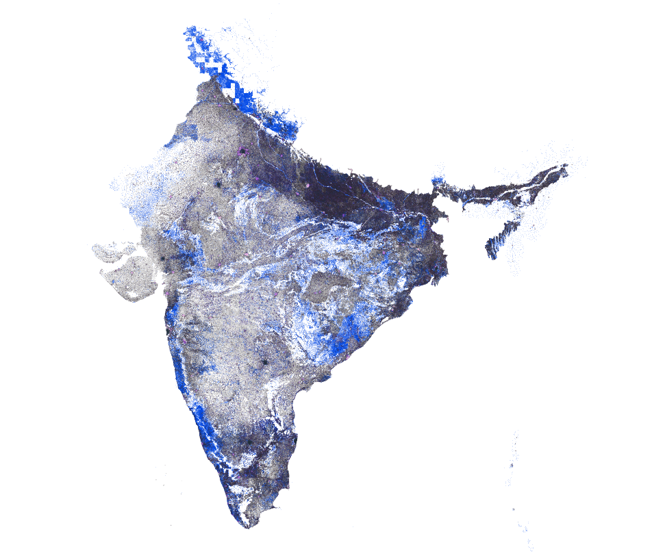
- **Germany**: Updates to locality, borough, and neighbourhood records in Hamburg (Issue [#1816](https://github.com/whosonfirst-data/whosonfirst-data/issues/1816))
  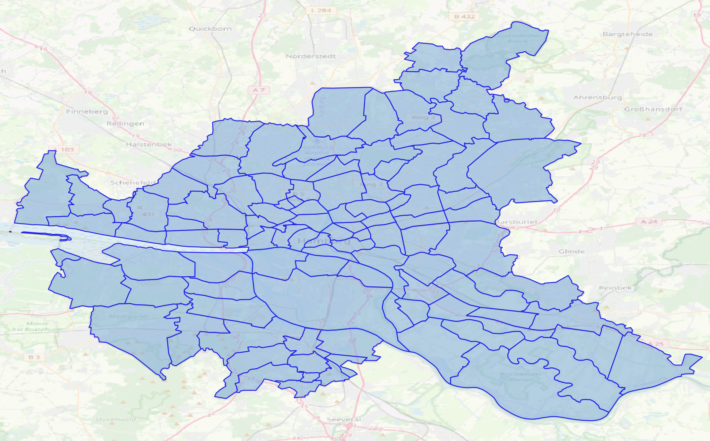
- **Various**: 4 [edits](https://github.com/pulls?q=is%3Apr+user%3Awhosonfirst-data+archived%3Afalse+merged%3A2022-06-01..2022-06-30+is%3Aclosed+) made directly to the individual country repos as PRs...
- **Blog post**: [State of the Gazetteer in 2023](https://whosonfirst.org/blog/2023/06/07/state-of-the-gazetteer/) - Since we launched in 2015, the Who’s On First places gazetteer project has grown in coverage, complexity, and supported applications. In this this post I will summarize Who’s On First’s key advantages, offer a comparative analysis of WOF and other open gazetteers, quantify our global coverage by placetype, offer score cards by country, dive into name localization, look at internationalization through the lens of disputed territories, and quantify geometry types and sources of those polygon and points, hold hands with and thank our sources, and invite collaboration.
- **Blog post**: [Introducing Karmashapes](https://whosonfirst.org/blog/2023/06/19/introducting-karmashapes/) - Thanks to the Karmashapes initiative, Who’s On First now provides the best open data for towns and villages in India.

### 2023 July

- **United Kingdom**: Update postalcode records, syncing them with the newest ONS dataset (Pull request [gb/#11](https://github.com/whosonfirst-data/whosonfirst-data-postalcode-gb/pull/11))
- **United Kingdom**: Migrated admin records from the `whosonfirst-data-admin-xy` repo to the appropriate `admin-gb` repo (Pull request [xy/#33](https://github.com/whosonfirst-data/whosonfirst-data-admin-xy/pull/33))
- **Norway**: Fixed bogus superseding in the Bergen locality record `whosonfirst-data-admin-xy` repo to the appropriate `admin-gb` repo (Issue [#2148](https://github.com/whosonfirst-data/whosonfirst-data/issues/2148))
- **Various**: 7 [edits](https://github.com/pulls?q=is%3Apr+user%3Awhosonfirst-data+archived%3Afalse+merged%3A2023-07-01..2023-07-31+is%3Aclosed+WOF+Editor+) made directly to the individual country repos as PRs...

### 2023 August

- **Global**: Rerun Wikidata name localization import on per-country repos. This yielded new name properties across 269,088 records. (Issue [#1656](https://github.com/whosonfirst-data/whosonfirst-data/issues/2151))
- **Global**: Ensure placetype_alt listed features are exported at both levels in Geocode.Earth's Who's On First shapefile distributions. (Issue [pelias/wof#43](https://github.com/pelias/wof/pull/43))
- **Global**: The `modified` fields in Geocode.Earth's Who's On First distributions have been updated (from `date`) to match SPR conventions. (Issue [#2160](https://github.com/whosonfirst-data/whosonfirst-data/issues/2160))
- **Various**: 2 [edits](https://github.com/pulls?q=is%3Apr+user%3Awhosonfirst-data+archived%3Afalse+merged%3A2023-08-01..2023-08-31+is%3Aclosed+WOF+Editor+) made directly to the individual country repos as PRs...

### 2023 September

- **Global**: Substantially increase name and label property coverage across various placetypes. (Issue [#2154](https://github.com/whosonfirst-data/whosonfirst-data/issues/2154))
- **Global**: Add support for new placelocal property in Geocode.Earth's Who's On First shapefile distributions. (Issue [#2153](https://github.com/whosonfirst-data/whosonfirst-data/issues/2153))
- **Various**: 5 [edits](https://github.com/pulls?q=is%3Apr+user%3Awhosonfirst-data+archived%3Afalse+merged%3A2023-09-01..2023-09-30+is%3Aclosed+WOF+Editor+) made directly to the individual country repos as PRs...

### 2023 October

- **Global**: Crawl each admin repository to add additional concordance keys and values for "official" government sources, and additionally indicate which of the many concordances should be considered as "official" with a new `wof:concordances_official` property. Commonly available on coarse admin placetype features and limited coverage for `locality` and `localadmin` features. Issue [#2164](https://github.com/whosonfirst-data/whosonfirst-data/issues/2164))
- **Global**: Geocode.Earth's Who's On First distributions now support the new official concordance keys and values, and removed the name contraint. (Issue [pelias/wof#49](https://github.com/pelias/wof/pull/49) and [pelias/wof#52](https://github.com/pelias/wof/pull/52))
- **Spain**: Using data from Organismo Autonomo Centro Nacional de Information Geografica (CNIG), update administrative records in Spain – including Ceuta and Melilla. Issue [#706](https://github.com/whosonfirst-data/whosonfirst-data/issues/706))
- **United Kingdom**: Wrangle UK records, moving them from the `admin-xy` repository to the `admin-gb` repository. Issue [#2024](https://github.com/whosonfirst-data/whosonfirst-data/issues/2024))
- **Various**: 21 [edits](https://github.com/pulls?q=is%3Apr+user%3Awhosonfirst-data+archived%3Afalse+merged%3A2023-10-01..2023-10-31+is%3Aclosed+WOF+Editor+) made directly to the individual country repos as PRs...

### 2023 November

- **United Kingdom**: Using United Kingdom and Northern Ireland Ordnance Survey data, update records and geometries at various placetypes, including `localadmin`, `county`, `macrocounty`, `region`, `macroregion`, and `country` records. Additional work is contemplated at the `locality` level but not included here. Pull request [#92](https://github.com/whosonfirst-data/whosonfirst-data-admin-gb/pull/92) as a downpayment on issue [#1871](https://github.com/whosonfirst-data/whosonfirst-data/issues/1871)
- **Various**: A quiet month

### 2023 Decemmber

- **Various**: 15 [edits](https://github.com/pulls?q=is%3Apr+user%3Awhosonfirst-data+archived%3Afalse+merged%3A2023-12-01..2023-12-31+is%3Aclosed+WOF+Editor+) made directly to the individual country repos as PRs...

_NOTE: This document was created 2019 November._
